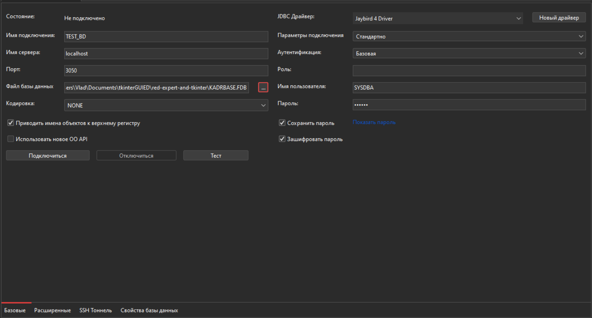
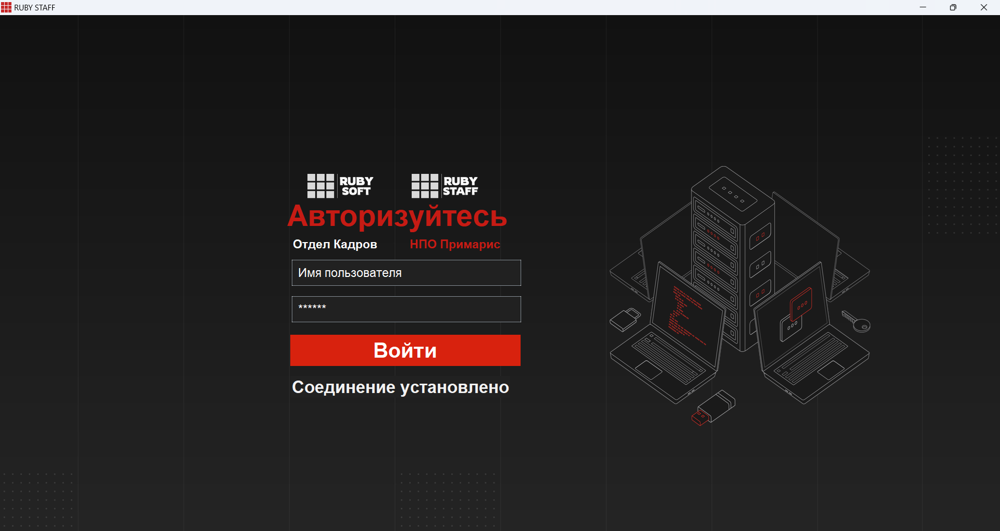
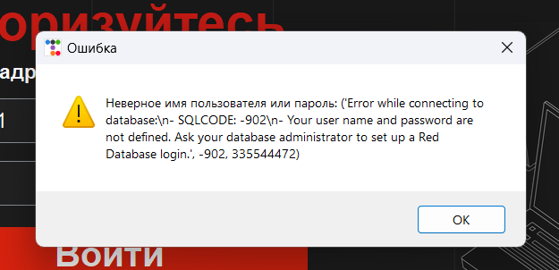
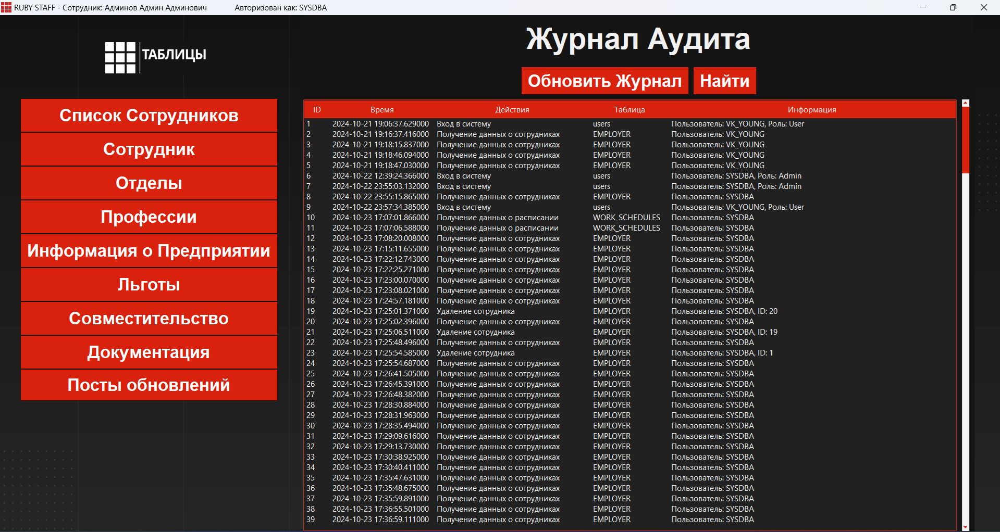
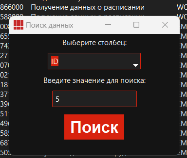

# Red Expert и Tkinter: Взаимодействие с базой данных

Этот проект демонстрирует пример взаимодействия между графическим интерфейсом Tkinter и базой данных в Red Expert. В проекте представлены примеры логирования и работы с таблицами, а также обработка SQL-запросов.

## Оглавление

- [Описание проекта](#описание-проекта)
- [Требования](#требования)
- [Установка и настройка](#установка-и-настройка)
- [Прочие особенности запуска](#прочие-особенности-запуска)
- [Лицензия](#лицензия)
- [Авторы](#авторы)

## Описание проекта

Проект предназначен для демонстрации работы с базой данных Red Expert через графический интерфейс, созданный с использованием библиотеки Tkinter. В проекте реализованы следующие функции:
- Создание и подключение к базе данных.
- Логирование действий пользователя.
- Выполнение SQL-запросов и отображение результатов в таблице.
- Обработка ошибок и уведомления пользователя.
- Удобный интерфейс для управления данными.

## Требования

Для запуска проекта вам понадобится:
- Python 3.7 или выше.
- Установленная библиотека Tkinter (обычно входит в стандартную библиотеку Python).
- Доступ к Red Expert и созданная база данных.
- Установленные зависимости из файла `requirements.txt`.

## Установка и настройка

1. **Клонируйте репозиторий:**
   ```bash
   git clone https://github.com/ваш-username/red-expert-and-tkinter.git
   cd red-expert-and-tkinter
2. **Установите необходимые зависимости:**
   ```bash 
   pip install -r requirements.txt
3. **Создайте или откройте базу данных в Red Expert**
   - Установите Red DataBase с **[сайта Red Data base](https://reddatabase.ru/ru/products/)**
   - Установите Red Expert с **[сайта Red Expert](https://reddatabase.ru/ru/downloads/redexpert/)**
   - Откройте Red Expert
   - Создайте подключение с данными настройками
   

4. **Пробуйте запустить через файл Auth.py**
    Это начальный запускаемый файл Python, в котором происходит авторизация и задавание начальных значений для работы над другими файлами проекта
    Запуск происходит в папке red-expert-and-tkinter
    ```bash 
    cd red-expert-and-tkinter
    python Auth.py
5. **Прочие особенности запуска**
    Если хотите запустить прочие файлы таблиц или меню, то используйте следующий шаблон
    Вам необходимо в добавок к запускаемому файлу указать: Название файла, Логин, Пароль, Роль
    Вот пример реализации запуска следующего после Auth.py файла:
    ```bash 
    cd init
    python ADMIN_MODE.py SYSDBA 010802 Admin

# Принцип и назначение проекта 
Данный проект работает по принципу переадресации по файлам. Когда пользователь входит в файл Auth.py он авторизовывается. После авторизации он переходит на следующий файл. В зависимости от роли в базе данных он может перейти либо на ADMIN_MODE.py либо на USER_MODE.py.
После этого пользователь может перейти на любой файл табоицы в которой сможет работать 
Полная структура представлена вот так
## Структура проекта 
        red-expert-and-tkinter/
        ├── Auth.py                # Основной файл приложения
        ├── requirements.txt       # Зависимости проекта
        ├── README.md              # Документация проекта
        ├── src                    # Папка с картинками
        ├── font                   # Папка с шрифтами
        └── init
            ├── USER_MODE.py       # Файл меню Пользователя
            ├── ADMIN_MODe.py      # Файл меню Администратора
            └── tables             # Папка с таблицами
                ├── benefit.py                                   # Файл таблицы benefits
                ├── DEPARTMENT.py                                # Файл таблицы Departement
                ├── DOCUMENTS.py                                 # Файл таблицы Documentation
                ├── EMPLOYER.py                                  # Файл таблицы Employer
                ├── EMPLOYER_LIST.py                             # Файл таблицы Employer_list
                ├── factor_information.py                        # Файл таблицы factor_information
                ├── POSTS.py                                     # Файл таблицы POSTS
                ├── PROFFESION.py                                # Файл таблицы Proffesion
                ├── sovmest.py                                   # Файл таблицы Sovmest
                └── button_function
                    ├── add_button.py                           # Функционал кнопки добавления
                    ├── delete_button.py                        # Функционал кнопки удаления
                    ├── edit_button.py                          # Функционал кнопки редактирования
                    ├── refresh_button.py                       # Функционал кнопки обновления таблицы
                    └── search_button.py                        # Функция кнопки поиска
                └── function
                    ├── conn_base.py                          # Общая функция подключения к базе данных
                    ├── convert_date.py                       # Функции конвертирования даты в человеческий вид и обратно
                    ├── copy_selected_row.py                  # Функции копирования строки таблицы
                    ├── custom_front.py                       # Функция добавления и работы шрифтов
                    ├── document.py                           # Функции работы вывода печати и создания PDF документов
                    ├── fetch_data.py                         # Функции получения данных с таблицы
                    ├── get_user_data.py                      # Функции получения данных об пользователя приложения
                    ├── log_action.py                         # Функции журналирования действия пользователей в программе
                    └── translate_colums.py                   # Заготовленный функции для отображения в таблицах заголовков
# Окно авторизации

В окне логина представленна авторизациия в Red Expert посредством пользователя. Мы используем данные пользователя в самой базе для входа. Для этого выполняем данную функцию:
 ```python
    def login():
        username = entry_username.get()
        password = entry_password.get()

        try:
            database_path =  current_dir / 'KADRBASE.FDB'

            print(database_path)
            conn = fdb.connect(
                host='localhost',
                database=database_path,
                user=username,
                password=password,
                port=3050,
                charset='utf8'
            )

            cursor = conn.cursor()

            # проверка ролей
            cursor.execute("""
                SELECT DISTINCT RDB$RELATION_NAME 
                FROM RDB$USER_PRIVILEGES 
                WHERE RDB$USER = ? 
                AND RDB$PRIVILEGE = 'M'
                AND RDB$RELATION_NAME NOT LIKE 'RDB$%'
            """, (username.strip().upper(),))
            
            roles = [row[0].strip() for row in cursor.fetchall()]
            conn.close()
            if 'ADMINISTRATOR_APP' in roles:
                role = "Admin"
                messagebox.showinfo("Успех", f"Авторизация успешна! \n Вы авторизовались как {username} \n Вы авторизовались как Администратор")
                login_window.destroy()
                subprocess.Popen(["python", str(current_dir / "init" / 'ADMIN_MODE.py'), username, password, role])
            elif 'EMPLOYER_APP' in roles:
                role = "User"
                messagebox.showinfo("Успех", f"Авторизация успешна! \n Вы авторизовались как {username} \n Вы авторизовались как Пользователь")
                login_window.destroy()
                subprocess.Popen(["python", str(current_dir / "init" /'USER_MODE.py'), username, password, role])
            else:
                messagebox.showwarning("Ошибка", "Пользователь не имеет подходящей роли.")
        except fdb.Error as e:
            messagebox.showwarning("Ошибка", f"Неверное имя пользователя или пароль: {e}")
```

Тут мы указываем данные полученные с inputbox из строк Tkinter. После этого выполняем вход в базу данных через бибилеотеку JBD в которой по шаблону ввводим наши данные:
В особенности задавания данных. Данный проект работает на локальном хосте. Стоит учитывать, так как база данных по умолчанию всегда активна на вашем устройстве, а для работы с другими базами придется изменить заполенние кода, в соотсвествии с api JBD
```python
    conn = fdb.connect(
        host='localhost',              # Указываем тип подключения Локальный  / Сетевой
        database=database_path,        # Для локального => Указываем расположение файла базы данных Red Expert
        user=username,                 # Указываем данные для авторизации. Можно вводить и заготовленные через "username"
        password=password,             # Указываем пароль. Если вы хотите использовать захешшированные пароли. То при создании пользователя в Red Expert используйте галочку зашифровать пароль. После этого вам будет необхоидмо добавить функцию шифровки через ключ Red Expert или другим методом. В данном примере используется обычный пароль без хешшифрования и шифрования.
        port=3050,                     # Указываем порт по которому мы работаем с баззой данных и на котором работает база в Red Expert. Поменять можно в настройках базы данных или при создании ее.
        charset='utf8'                 # Указываем кодировку текста в котором есть поддержка русских букв и символов. 
    )
    cursor = conn.cursor()             # Закрываем запрос на подключение
```
Если ошибок нет, то запрос пройдет успешно, без вывода каких либо значений. В случаии ошибки, Red Expert отправляет ошибку обратно. В данном примере, уловление ошибки подключения представленно ввиде messagebox:
```python
    messagebox.showwarning("Ошибка", f"Неверное имя пользователя или пароль: {e}")
```


Далее в проекте идет проверка на роли. В Red Expert сущуствуют как обычные таблицы, которые создаются пользователями так и системные. В особенности этих таблиц в том, что они не изменяемые, но можно вводить и получать данные с них. В данном примере указано то, что мы ищем роль указанного пользователя в таблице **RDB$USER_PRIVILEGES**, где **RDB$USER** имеет флаг **'M'**. Это означает что пользователь имеет право на **UPDATTE** **DELETE** **INSERT** в таблицах. И этот запрос выведет именно таблицы в которых есть доступ. 
```sql
    SELECT DISTINCT RDB$RELATION_NAME 
    FROM RDB$USER_PRIVILEGES 
    WHERE RDB$USER = ? 
    AND RDB$PRIVILEGE = 'M'
    AND RDB$RELATION_NAME NOT LIKE 'RDB$%'
```
Этот запрос возвращает список таблиц (или других объектов), к которым пользователь имеет права на модификацию ('M'), исключая системные таблицы Firebird. В вашем коде этот запрос используется для проверки ролей пользователя: если пользователь имеет доступ к таблице ADMINISTRATOR_APP, он считается администратором, а если к EMPLOYER_APP — пользователем.
Если пользователь имеет права на модификацию таблиц EMPLOYER_APP и SOME_TABLE, результат запроса будет:
```
    EMPLOYER_APP
    SOME_TABLE
```
Если пользователь не имеет прав на модификацию ни одной таблицы, результат будет пустым.

### Функция проверки подключения к базе данных 
Допустим необходимо проверить, включена база данных, работает ли, выполняет ли запросы. В проекте есть функция **auto_connect**, в которой меняется один из элементов Tkinter Label.
Функция auto_connect() предназначена для автоматической проверки подключения к базе данных Firebird (FDB) с использованием заранее заданных учетных данных. Вот пошаговое описание того, как она работает:
**Определение пути к базе данных:**
```python
   database_path = current_dir / 'KADRBASE.FDB'
```
Здесь формируется путь к базе данных KADRBASE.FDB, который находится в той же директории, что и текущий скрипт.
**Попытка подключения к базе данных:**
```python
conn = fdb.connect(
    host='localhost',
    database=database_path,
    user='GUEST',  # Отрублено все кроме проверки подключения
    password='010802',
    port=3050,
    charset='utf8'  
)
```
- host='localhost': Указывает, что база данных находится на локальной машине.
- database=database_path: Указывает путь к базе данных.
- user='GUEST': Используется предопределенный пользователь GUEST для подключения.
- password='010802': Пароль для пользователя GUEST.
- port=3050: Порт, на котором работает сервер Red Expert.
- charset='utf8': Указывает кодировку, используемую для соединения.

После успешного подключения соединение закрывается, так как цель функции — только проверить возможность подключения.
**Обновление статуса подключения:**
```python
status_label.config(text="Соединение установлено")
status_label.config(font=custom_font_status)
```
Если подключение прошло успешно, текст в status_label обновляется на "Соединение установлено", и применяется шрифт custom_font_status.
**Обработка ошибок:**
```python
except fdb.Error as e:
    print(f"{e}")
    status_label.config(text=f"Ошибка подключения к базе данных: {e}")
    status_label.config(font=custom_font_status)
```
Если в процессе подключения возникает ошибка (например, неправильные учетные данные, база данных недоступна и т.д.), она перехватывается блоком except. В этом случае:
- Ошибка выводится в консоль.
- Текст в status_label обновляется на сообщение об ошибке, содержащее описание ошибки.
- Применяется шрифт custom_font_status.
Функция auto_connect() пытается подключиться к базе данных Firebird с использованием предопределенных учетных данных. Если подключение успешно, она обновляет статус на "Соединение установлено". Если возникает ошибка, она выводит сообщение об ошибке и обновляет статус на соответствующее сообщение об ошибке. Это позволяет пользователю сразу узнать, доступна ли база данных и правильно ли настроено подключение.

## Код Tkinter в окне авторизации 
Теперь переходим к инцилизации окна Tkinyer. Этот код создает графический интерфейс для авторизации пользователя с использованием библиотеки Tkinter и ее расширения ttkbootstrap для стилизации. Вот краткое описание того, как работает код и что происходит:
***
1. **Инициализация окна:**
    - **login_window = ttkb.Window(themename="simplex"):** Создается главное окно приложения с использованием темы simplex из ttkbootstrap.
    - **login_window.title("RUBY STAFF")**: Устанавливается заголовок окна.
    - **login_window.geometry(...)**: Окно растягивается на весь экран с помощью winfo_screenwidth() и winfo_screenheight().
    - **login_window.state('zoomed')**: Окно открывается в полноэкранном режиме.
    - **login_window.iconbitmap(icon_path)**: Устанавливается иконка приложения.
2. **Загрузка и отображение фонового изображения:**
    - **background_image = Image.open(...)**: Загружается фоновое изображение с помощью библиотеки PIL (Pillow).
    - **background_image.resize(...)**: Изображение масштабируется под размер экрана.
    - **background_photo = ImageTk.PhotoImage(background_image)**: Изображение конвертируется в формат, поддерживаемый Tkinter.
    - **background_label = tk.Label(..., image=background_photo)**: Создается метка с фоновым изображением, которая растягивается на всё окно.
3. **Настройка шрифтов:**
    - **custom_font()**: Загружаются пользовательские шрифты из файлов .ttf с помощью библиотеки fontTools.
    - **custom_font_header, custom_font_text, и т.д.**: Определяются стили шрифтов для различных элементов интерфейса.
4. **Создание Canvas для размещения элементов:**
    - **canvas = tk.Canvas(...)**: Создается холст (Canvas) для размещения текста и изображений.
    - **canvas.create_image(...)**: На холст добавляется фоновое изображение.
    - **canvas.create_text(...)**: Добавляются текстовые элементы, такие как "Авторизуйтесь", "Отдел Кадров" и "НПО Примарис".

5. **Поля ввода (Entry):**
    - **entry_username и entry_password**: Создаются поля для ввода имени пользователя и пароля.
    - **add_placeholder_user, remove_placeholder_user, и аналогичные функции**: Реализуется функциональность placeholder (подсказки в полях ввода), которая исчезает при фокусе и появляется, если поле пустое.
    - **entry_username.bind(...) и entry_password.bind(...)**: Привязываются события фокуса (<FocusIn> и <FocusOut>) к функциям для управления placeholder.

6. **Кнопка входа:**
    - **button_login = ttkb.Button(...)**: Создается кнопка "Войти", которая вызывает функцию login() при нажатии.
    - **button_login.place(...)**: Кнопка размещается в центре окна.

7. **Проверка подключения к базе данных:**
    - **auto_connect()**: Функция проверяет подключение к базе данных Red Expert с использованием предопределенных учетных данных (GUEST/010802).
    - **status_label**: Отображает статус подключения ("Соединение установлено" или "Ошибка подключения").

8. **Дополнительные изображения:**
    - **laptop_image, company_image, app_image:** Загружаются и отображаются дополнительные изображения (например, логотипы компании и приложения) на холсте.

9. **Запуск основного цикла:**
    - **login_window.mainloop()**: Запускается главный цикл обработки событий Tkinter, который поддерживает окно открытым и реагирует на действия пользователя.


# Окно Администратора (Особенности работы с таблицами)

Это окно представляет собой интерфейс администратора для системы управления персоналом (например, кадровой системы). Оно предназначено для выполнения административных задач, таких как:
    - Просмотр и управление данными:
    - Сотрудники (например, добавление, редактирование, удаление).
    - Отделы (структура организации).
    - Профессии (должности и специализации).
    - Документация (например, трудовые договоры, приказы).
    - Льготы (социальные гарантии для сотрудников).
    - Совместительство (работа на нескольких должностях).
    - Посты обновлений (например, новости или уведомления).
    - Журнал аудита:

В центральной части окна отображается таблица с журналом аудита, где фиксируются все действия пользователей системы (например, кто, когда и какие изменения внес в базу данных).
Поиск и фильтрация данных:
- Администратор может искать записи в журнале аудита по различным критериям (например, по дате, действию, таблице или дополнительной информации).
Интеграция с базой данных:
- Окно взаимодействует с базой данных Firebird (или Red Expert), извлекая данные (например, информацию о сотрудниках, отделах) и записывая изменения (например, логи действий пользователей).


## Журнал Аудита
 Журнал аудита (или лог действий) — это важный инструмент для отслеживания и регистрации всех изменений и действий, которые происходят в системе. Он играет ключевую роль в обеспечении прозрачности, безопасности и контроля над данными. Вот основные цели и задачи журнала аудита:
 Работает таблица через treeview в Tkinter
 ```python
 treeview = ttk.Treeview(center_frame, bootstyle="primary", selectmode="extended", columns=("ID", "Время", "Действия", "Таблица", "Информация"), show='headings')

column_widths = [50, 200, 300, 150, 550]  
for col, width in zip(("ID", "Время", "Действия", "Таблица", "Информация"), column_widths):
    treeview.heading(col, text=col, command=lambda c=col: sort_treeview(c, False))
    treeview.column(col, width=width, stretch=False)  
 ```

 Давйте расмотрим поподробнее:
 1. **Создание таблицы (Treeview):**
```python
treeview = ttk.Treeview(center_frame, bootstyle="primary", selectmode="extended", columns=("ID", "Время", "Действия", "Таблица", "Информация"), show='headings')
```
- **center_frame**: Это фрейм, в котором будет размещена таблица. bootstyle="primary": Применяется стиль "primary" из библиотеки ttkbootstrap для оформления таблицы.
- **selectmode="extended"**: Позволяет пользователю выбирать несколько строк в таблице (например, с помощью клавиш Ctrl или Shift).
- **columns=("ID", "Время", "Действия", "Таблица", "Информация")**: Определяет колонки таблицы. В данном случае это: ID — уникальный идентификатор записи. Время — дата и время события. Действия — тип действия (например, "Добавление", "Редактирование"). Таблица — название таблицы, в которой произошли изменения. Информация — дополнительные сведения о действии.
- **show='headings'**: Указывает, что таблица должна отображать только заголовки колонок (без дополнительных элементов, таких как дерево).
2. **Настройка ширины колонок:**
Это список, который определяет ширину каждой колонки в пикселях:
- ID: 50 пикселей.
- Время: 200 пикселей.
- Действия: 300 пикселей.
- Таблица: 150 пикселей.
- Информация: 550 пикселей
3. **Настройка заголовков и колонок:**
```python
for col, width in zip(("ID", "Время", "Действия", "Таблица", "Информация"), column_widths):
    treeview.heading(col, text=col, command=lambda c=col: sort_treeview(c, False))
    treeview.column(col, width=width, stretch=False)
```
Цикл for:
Проходит по каждой колонке и ее ширине, используя функцию zip, чтобы объединить названия колонок и их ширины.
Настройка заголовков:
```python
treeview.heading(col, text=col, command=lambda c=col: sort_treeview(c, False))
```
- treeview.heading(...): Настраивает заголовок колонки.
- col: Название колонки (например, "ID", "Время").
- text=col: Текст заголовка (совпадает с названием колонки).
- command=lambda c=col: sort_treeview(c, False): Привязывает функцию sort_treeview к заголовку колонки. При нажатии на заголовок таблица будет отсортирована по этой колонке.
- lambda c=col: ...: Передает название колонки (col) в функцию sort_treeview.
- sort_treeview(c, False): Функция сортировки, где c — название колонки, а False указывает на сортировку по возрастанию.
Настройка колонок:
```python
treeview.column(col, width=width, stretch=False)
```
treeview.column(...): Настраивает свойства колонки.
- col: Название колонки.
- width=width: Устанавливает ширину колонки в пикселях (значение из списка column_widths).
- stretch=False: Указывает, что колонка не должна растягиваться при изменении размера окна.
4. **Функция сортировки:**
```python
def sort_treeview(column, reverse):
    data = [(treeview.set(child, column), child) for child in treeview.get_children('')]
    data.sort(reverse=reverse)

    for index, (val, child) in enumerate(data):
        treeview.move(child, '', index)

    treeview.heading(column, command=lambda: sort_treeview(column, not reverse))
```
Как это работает:
- Сбор данных: Для каждой строки в таблице извлекается значение в выбранной колонке (treeview.set(child, column)).Данные сохраняются в виде списка кортежей (значение, строка).
- Сортировка: Данные сортируются по значению в выбранной колонке. Если reverse=True, сортировка выполняется по убыванию.
- Обновление таблицы: Строки перемещаются в соответствии с отсортированным порядком.
- Обновление команды заголовка: При следующем нажатии на заголовок сортировка будет выполнена в обратном порядке (not reverse).
### Кнопка Обновить и Поиск

1. **Кнопка "Обновить":**
Кнопка "Обновить" обновляет данные в таблице аудита, запрашивая актуальные записи из базы данных.
Код кнопки:
```python
refresh_button = ttkb.Button(button_table, bootstyle="primary", text="Обновить Журнал", command=lambda: update_treeview(username, password, role))
refresh_button.pack(side="left", padx=5)
```
- command=lambda: update_treeview(username, password, role): При нажатии на кнопку вызывается функция update_treeview, которая обновляет данные в таблице.

Функция update_treeview:
```python
def update_treeview(username, password, role):
    for row in treeview.get_children():
        treeview.delete(row)

    logs = fetch_user_logs(username, password)
    for log in logs:
        treeview.insert("", "end", values=log)
```
- treeview.get_children(): Возвращает список всех строк в таблице.
- treeview.delete(row): Удаляет каждую строку из таблицы.
- fetch_user_logs(username, password): Запрашивает актуальные данные из базы данных (таблица USER_LOGS).
- treeview.insert("", "end", values=log): Вставляет новые данные в таблицу.
Как это работает:
При нажатии на кнопку "Обновить":
    1. Все текущие строки в таблице удаляются.
    2. Выполняется запрос к базе данных для получения новых данных.
    3. Новые данные вставляются в таблицу.
2. **Кнопка "Поиск":**
Кнопка "Поиск" открывает новое окно, где пользователь может задать критерии для поиска записей в таблице аудита.
Код кнопки:
```python
find_button = ttkb.Button(button_table, bootstyle="primary", text="Найти", command=open_search_window)
find_button.pack(side="left", padx=5)
```
При нажатии на кнопку вызывается функция open_search_window, которая открывает окно поиска.
Функция open_search_window:
```python
def open_search_window():
    search_window = tk.Toplevel(admin_window)
    search_window.title("Поиск данных")
    search_window.geometry("350x250")
    current_dir = Path(__file__).resolve().parent
    icon_path = current_dir.parents[0] / 'src' / 'r_app.ico'
    search_window.iconbitmap(icon_path)
    
    ttkb.Label(search_window, text="Выберите столбец:", bootstyle="light").pack(pady=5)

    column_combobox = ttkb.Combobox(search_window, bootstyle="primary", values=["ID", "Время", "Действия", "Таблица", "Информация"])
    column_combobox.pack(pady=5)

    ttkb.Label(search_window, text="Введите значение для поиска:", bootstyle="light").pack(pady=5)
    
    search_entry = ttkb.Entry(search_window, bootstyle="primary")
    search_entry.pack(pady=5)

    date_entry = ttkb.DateEntry(search_window, bootstyle="primary", width=12)
    date_entry.pack(pady=5)
    date_entry.pack_forget()  

    def perform_search():
        column = column_combobox.get()
        for row in treeview.get_children():
            treeview.delete(row)

        conn = connect_to_database(username, password)
        if conn:
            cursor = conn.cursor()
            if column == "Время":
                search_value = date_entry.entry.get()
                search_value = datetime.strptime(search_value, "%d.%m.%Y")
                start_of_day = datetime.combine(search_value, datetime.min.time())
                end_of_day = datetime.combine(search_value, datetime.max.time())
                query = "SELECT * FROM USER_LOGS WHERE LOG_TIME >= ? AND LOG_TIME <= ?"
                cursor.execute(query, (start_of_day, end_of_day))
            elif column == "ID":
                search_value = search_entry.get()
                try:
                    search_value = int(search_value) 
                    query = "SELECT * FROM USER_LOGS WHERE ID = ?"
                    cursor.execute(query, (search_value,))
                except ValueError:
                    messagebox.showerror("Ошибка", "ID должен быть числом")
                    return
            elif column == "Информация":
                query = "SELECT * FROM USER_LOGS WHERE ADDITIONAL_INFO LIKE ?"
                search_value = search_entry.get()
                cursor.execute(query, (f'%{search_value}%',))
            else:
                search_value = search_entry.get()
                if column == "Действия":
                    query = "SELECT * FROM USER_LOGS WHERE ACTION LIKE ?"
                elif column == "Таблица":
                    query = "SELECT * FROM USER_LOGS WHERE TABLE_NAME LIKE ?"
                else:
                    search_window.destroy()
                    return
                
                cursor.execute(query, (f'%{search_value}%',))

            results = cursor.fetchall()
            conn.close()

            for result in results:
                treeview.insert("", "end", values=result)
            
        search_window.destroy()
```
- search_window = tk.Toplevel(admin_window): Создается новое окно для поиска.
- column_combobox: Позволяет выбрать колонку для поиска (например, "ID", "Время", "Действия").
- search_entry: Поле для ввода значения поиска.
- date_entry: Поле для выбора даты (используется, если выбрана колонка "Время").
- perform_search:Функция, которая выполняет поиск по выбранным критериям.

Как это работает:
При нажатии на кнопку "Поиск": Открывается новое окно с полями для выбора колонки и ввода значения поиска.
Пользователь выбирает колонку и вводит значение: Если выбрана колонка "Время", используется поле для выбора даты.
Для других колонок используется текстовое поле.
При нажатии на кнопку "Поиск" в окне поиска:
Все текущие строки в таблице удаляются.
Выполняется SQL-запрос к базе данных с учетом выбранных критериев.
Результаты поиска отображаются в таблице.

## Отображение данных пользователя в заголовке окна приложения
В этом коде отображение данных пользователя в заголовке окна администратора происходит в несколько этапов. Давайте разберем, как это работает.
1. **Получение данных пользователя:**
    Данные пользователя (имя, фамилия, отчество и логин) извлекаются из базы данных с помощью функции get_user_data. Эта функция вызывается при запуске программы.
    ```python
    def get_user_data(username, password, user_login):
    conn = connect_to_database(username, password)
    if conn:
        cursor = conn.cursor()
        cursor.execute("EXECUTE PROCEDURE GET_USER_DATA(?)", (user_login,))
        user_data = cursor.fetchone()
        conn.close()
        return user_data
    return None
    ```
    - username и password: Передаются в качестве аргументов при запуске программы (через командную строку).
    - user_login: Логин пользователя, который также передается как аргумент.
    - EXECUTE PROCEDURE GET_USER_DATA(?): Выполняется хранимая процедура в базе данных, которая возвращает данные пользователя (например, имя, фамилию, отчество и логин).
2. **Проверка данных пользователя:**
    После получения данных из базы данных проверяется, были ли они успешно извлечены. Если данные отсутствуют, программа завершается с сообщением об ошибке.
    ```python
        if user_data:
        user_name, first_name, middle_name, last_name = user_data
    else:
        messagebox.showinfo("Ошибка", "Данные о пользователе не найдены")
        sys.exit(1)
    ```
    - user_data: Кортеж с данными пользователя, возвращенный из базы данных.
    - user_name: Логин пользователя.
    - first_name, middle_name, last_name: Имя, отчество и фамилия пользователя.
3. **Отображение данных в заголовке окна:**
    Данные пользователя отображаются в заголовке окна администратора с помощью метода title.
    ```python
    admin_window.title(f"RUBY STAFF - Сотрудник: {first_name} {middle_name} {last_name}             Авторизован как: {user_name}")
    ```
