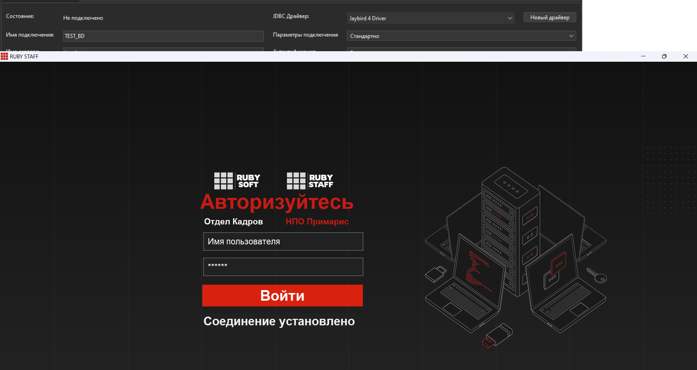

# Red Expert и Tkinter: Взаимодействие с базой данных

Этот проект демонстрирует пример взаимодействия между графическим интерфейсом Tkinter и базой данных в Red Expert. В проекте представлены примеры логирования и работы с таблицами, а также обработка SQL-запросов.

## Оглавление

- [Описание проекта](#описание-проекта)
- [Требования](#требования)
- [Установка и настройка](#установка-и-настройка)
- [Прочие особенности запуска](#прочие-особенности-запуска)
- [Лицензия](#лицензия)
- [Авторы](#авторы)

## Описание проекта

Проект предназначен для демонстрации работы с базой данных Red Expert через графический интерфейс, созданный с использованием библиотеки Tkinter. В проекте реализованы следующие функции:
- Создание и подключение к базе данных.
- Логирование действий пользователя.
- Выполнение SQL-запросов и отображение результатов в таблице.
- Обработка ошибок и уведомления пользователя.
- Удобный интерфейс для управления данными.

## Требования

Для запуска проекта вам понадобится:
- Python 3.7 или выше.
- Установленная библиотека Tkinter (обычно входит в стандартную библиотеку Python).
- Доступ к Red Expert и созданная база данных.
- Установленные зависимости из файла `requirements.txt`.

## Установка и настройка

1. **Клонируйте репозиторий:**
   ```bash
   git clone https://github.com/ваш-username/red-expert-and-tkinter.git
   cd red-expert-and-tkinter
2. **Установите необходимые зависимости:**
   ```bash 
   pip install -r requirements.txt
3. **Создайте или откройте базу данных в Red Expert**
   - Установите Red DataBase с **[сайта Red Data base](https://reddatabase.ru/ru/products/)**
   - Установите Red Expert с **[сайта Red Expert](https://reddatabase.ru/ru/downloads/redexpert/)**
   - Откройте Red Expert
   - Создайте подключение с данными настройками
   

4. **Пробуйте запустить через файл Auth.py**
    Это начальный запускаемый файл Python, в котором происходит авторизация и задавание начальных значений для работы над другими файлами проекта
    Запуск происходит в папке red-expert-and-tkinter
    ```bash 
    cd red-expert-and-tkinter
    python Auth.py
5. **Прочие особенности запуска**
    Если хотите запустить прочие файлы таблиц или меню, то используйте следующий шаблон
    Вам необходимо в добавок к запускаемому файлу указать: Название файла, Логин, Пароль, Роль
    Вот пример реализации запуска следующего после Auth.py файла:
    ```bash 
    cd init
    python ADMIN_MODE.py SYSDBA 010802 Admin

    Также работает и для других файлов, подробнее будет описано в следующих главах.

# Принцип и назначение проекта 
    Данный проект работает по принципу переадресации по файлам. Когда пользователь входит в файл Auth.py он авторизовывается. После авторизации он переходит на следующий файл. В зависимости от роли в базе данных он может перейти либо на ADMIN_MODE.py либо на USER_MODE.py.
    После этого пользователь может перейти на любой файл табоицы в которой сможет работать 
    Полная структура представлена вот так
## Структура проекта 
        ```bash
        red-expert-and-tkinter/
        ├── Auth.py                # Основной файл приложения
        ├── requirements.txt       # Зависимости проекта
        ├── README.md              # Документация проекта
        ├── src                    # Папка с картинками
        ├── font                   # Папка с шрифтами
        └── init
            ├── USER_MODE.py       # Файл меню Пользователя
            ├── ADMIN_MODe.py      # Файл меню Администратора
            └── tables             # Папка с таблицами
                ├── benefit.py                                   # Файл таблицы benefits
                ├── DEPARTMENT.py                                # Файл таблицы Departement
                ├── DOCUMENTS.py                                 # Файл таблицы Documentation
                ├── EMPLOYER.py                                  # Файл таблицы Employer
                ├── EMPLOYER_LIST.py                             # Файл таблицы Employer_list
                ├── factor_information.py                        # Файл таблицы factor_information
                ├── POSTS.py                                     # Файл таблицы POSTS
                ├── PROFFESION.py                                # Файл таблицы Proffesion
                ├── sovmest.py                                   # Файл таблицы Sovmest
                └── button_function
                    ├── add_button.py                           # Функционал кнопки добавления
                    ├── delete_button.py                        # Функционал кнопки удаления
                    ├── edit_button.py                          # Функционал кнопки редактирования
                    ├── refresh_button.py                       # Функционал кнопки обновления таблицы
                    └── search_button.py                        # Функция кнопки поиска
                └── function
                    ├── conn_base.py                          # Общая функция подключения к базе данных
                    ├── convert_date.py                       # Функции конвертирования даты в человеческий вид и обратно
                    ├── copy_selected_row.py                  # Функции копирования строки таблицы
                    ├── custom_front.py                       # Функция добавления и работы шрифтов
                    ├── document.py                           # Функции работы вывода печати и создания PDF документов
                    ├── fetch_data.py                         # Функции получения данных с таблицы
                    ├── get_user_data.py                      # Функции получения данных об пользователя приложения
                    ├── log_action.py                         # Функции журналирования действия пользователей в программе
                    └── translate_colums.py                   # Заготовленный функции для отображения в таблицах заголовков
# Окно авторизации



 
