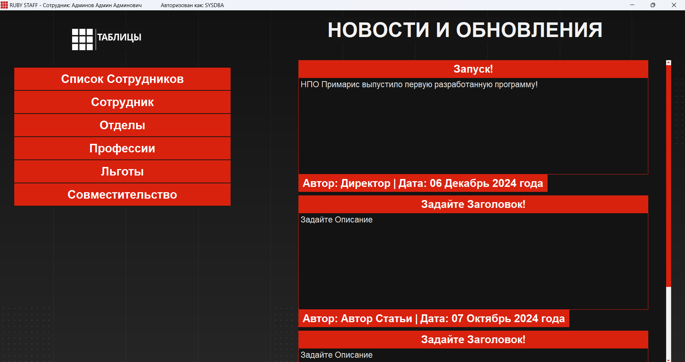
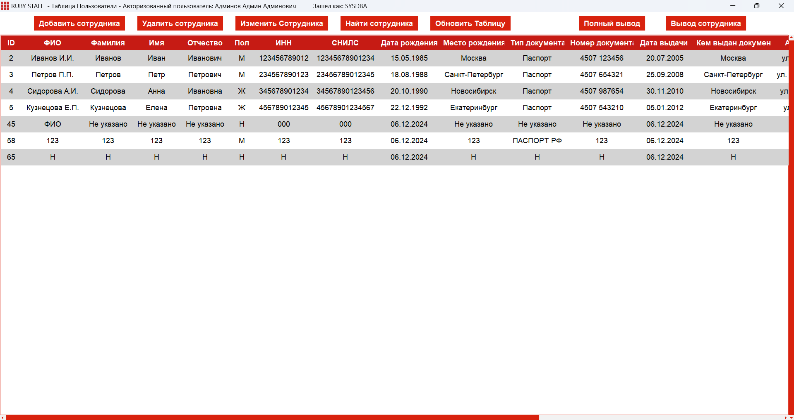
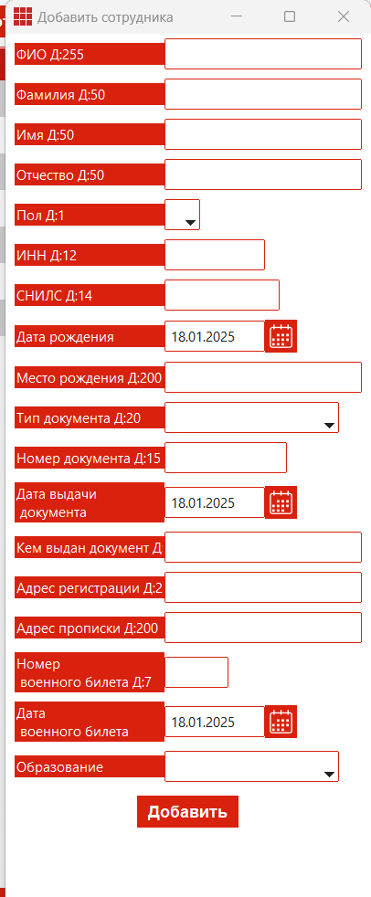
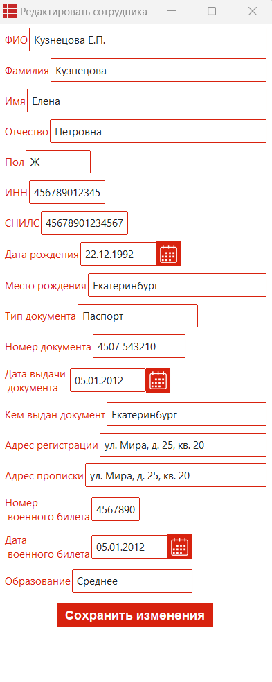
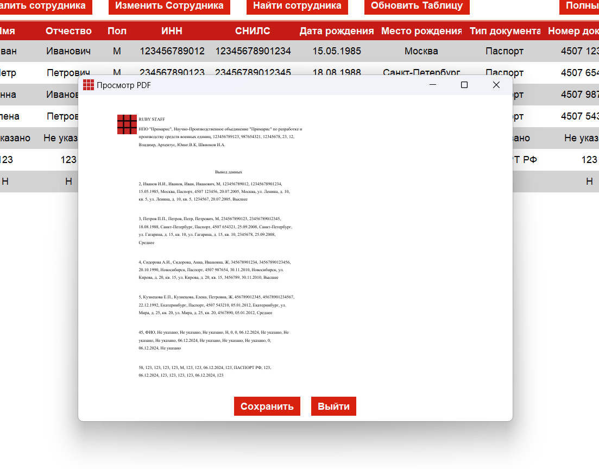

# Red Expert и Tkinter: Взаимодействие с базой данных

Этот проект демонстрирует пример взаимодействия между графическим интерфейсом Tkinter и базой данных в Red Expert. В проекте представлены примеры логирования и работы с таблицами, а также обработка SQL-запросов.

## Оглавление

- [Описание проекта](#описание-проекта)
- [Требования](#требования)
- [Установка и настройка](#установка-и-настройка)
- [Прочие особенности запуска](#прочие-особенности-запуска)
- [Лицензия](#лицензия)
- [Авторы](#авторы)

## Описание проекта

Проект предназначен для демонстрации работы с базой данных Red Expert через графический интерфейс, созданный с использованием библиотеки Tkinter. В проекте реализованы следующие функции:
- Создание и подключение к базе данных.
- Логирование действий пользователя.
- Выполнение SQL-запросов и отображение результатов в таблице.
- Обработка ошибок и уведомления пользователя.
- Удобный интерфейс для управления данными.

## Требования

Для запуска проекта вам понадобится:
- Python 3.7 или выше.
- Установленная библиотека Tkinter (обычно входит в стандартную библиотеку Python).
- Доступ к Red Expert и созданная база данных.
- Установленные зависимости из файла `requirements.txt`.

## Установка и настройка

1. **Клонируйте репозиторий:**
   ```bash
   git clone https://github.com/ваш-username/red-expert-and-tkinter.git
   cd red-expert-and-tkinter
2. **Установите необходимые зависимости:**
   ```bash 
   pip install -r requirements.txt
3. **Создайте или откройте базу данных в Red Expert**
   - Установите Red DataBase с **[сайта Red Data base](https://reddatabase.ru/ru/products/)**
   - Установите Red Expert с **[сайта Red Expert](https://reddatabase.ru/ru/downloads/redexpert/)**
   - Откройте Red Expert
   - Создайте подключение с данными настройками
   

4. **Пробуйте запустить через файл Auth.py**
    Это начальный запускаемый файл Python, в котором происходит авторизация и задавание начальных значений для работы над другими файлами проекта
    Запуск происходит в папке red-expert-and-tkinter
    ```bash 
    cd red-expert-and-tkinter
    python Auth.py
5. **Прочие особенности запуска**
    Если хотите запустить прочие файлы таблиц или меню, то используйте следующий шаблон
    Вам необходимо в добавок к запускаемому файлу указать: Название файла, Логин, Пароль, Роль
    Вот пример реализации запуска следующего после Auth.py файла:
    ```bash 
    cd init
    python ADMIN_MODE.py SYSDBA 010802 Admin

# Принцип и назначение проекта 
Данный проект работает по принципу переадресации по файлам. Когда пользователь входит в файл Auth.py он авторизовывается. После авторизации он переходит на следующий файл. В зависимости от роли в базе данных он может перейти либо на ADMIN_MODE.py либо на USER_MODE.py.
После этого пользователь может перейти на любой файл табоицы в которой сможет работать 
Полная структура представлена вот так
## Структура проекта 
        red-expert-and-tkinter/
        ├── Auth.py                # Основной файл приложения
        ├── requirements.txt       # Зависимости проекта
        ├── README.md              # Документация проекта
        ├── src                    # Папка с картинками
        ├── font                   # Папка с шрифтами
        └── init
            ├── USER_MODE.py       # Файл меню Пользователя
            ├── ADMIN_MODe.py      # Файл меню Администратора
            └── tables             # Папка с таблицами
                ├── benefit.py                                   # Файл таблицы benefits
                ├── DEPARTMENT.py                                # Файл таблицы Departement
                ├── DOCUMENTS.py                                 # Файл таблицы Documentation
                ├── EMPLOYER.py                                  # Файл таблицы Employer
                ├── EMPLOYER_LIST.py                             # Файл таблицы Employer_list
                ├── factor_information.py                        # Файл таблицы factor_information
                ├── POSTS.py                                     # Файл таблицы POSTS
                ├── PROFFESION.py                                # Файл таблицы Proffesion
                ├── sovmest.py                                   # Файл таблицы Sovmest
                └── button_function
                    ├── add_button.py                           # Функционал кнопки добавления
                    ├── delete_button.py                        # Функционал кнопки удаления
                    ├── edit_button.py                          # Функционал кнопки редактирования
                    ├── refresh_button.py                       # Функционал кнопки обновления таблицы
                    └── search_button.py                        # Функция кнопки поиска
                └── function
                    ├── conn_base.py                          # Общая функция подключения к базе данных
                    ├── convert_date.py                       # Функции конвертирования даты в человеческий вид и обратно
                    ├── copy_selected_row.py                  # Функции копирования строки таблицы
                    ├── custom_front.py                       # Функция добавления и работы шрифтов
                    ├── document.py                           # Функции работы вывода печати и создания PDF документов
                    ├── fetch_data.py                         # Функции получения данных с таблицы
                    ├── get_user_data.py                      # Функции получения данных об пользователя приложения
                    ├── log_action.py                         # Функции журналирования действия пользователей в программе
                    └── translate_colums.py                   # Заготовленный функции для отображения в таблицах заголовков
# Окно авторизации

В окне логина представленна авторизациия в Red Expert посредством пользователя. Мы используем данные пользователя в самой базе для входа. Для этого выполняем данную функцию:
 ```python
    def login():
        username = entry_username.get()
        password = entry_password.get()

        try:
            database_path =  current_dir / 'KADRBASE.FDB'

            print(database_path)
            conn = fdb.connect(
                host='localhost',
                database=database_path,
                user=username,
                password=password,
                port=3050,
                charset='utf8'
            )

            cursor = conn.cursor()

            # проверка ролей
            cursor.execute("""
                SELECT DISTINCT RDB$RELATION_NAME 
                FROM RDB$USER_PRIVILEGES 
                WHERE RDB$USER = ? 
                AND RDB$PRIVILEGE = 'M'
                AND RDB$RELATION_NAME NOT LIKE 'RDB$%'
            """, (username.strip().upper(),))
            
            roles = [row[0].strip() for row in cursor.fetchall()]
            conn.close()
            if 'ADMINISTRATOR_APP' in roles:
                role = "Admin"
                messagebox.showinfo("Успех", f"Авторизация успешна! \n Вы авторизовались как {username} \n Вы авторизовались как Администратор")
                login_window.destroy()
                subprocess.Popen(["python", str(current_dir / "init" / 'ADMIN_MODE.py'), username, password, role])
            elif 'EMPLOYER_APP' in roles:
                role = "User"
                messagebox.showinfo("Успех", f"Авторизация успешна! \n Вы авторизовались как {username} \n Вы авторизовались как Пользователь")
                login_window.destroy()
                subprocess.Popen(["python", str(current_dir / "init" /'USER_MODE.py'), username, password, role])
            else:
                messagebox.showwarning("Ошибка", "Пользователь не имеет подходящей роли.")
        except fdb.Error as e:
            messagebox.showwarning("Ошибка", f"Неверное имя пользователя или пароль: {e}")
```

Тут мы указываем данные полученные с inputbox из строк Tkinter. После этого выполняем вход в базу данных через бибилеотеку JBD в которой по шаблону ввводим наши данные:
В особенности задавания данных. Данный проект работает на локальном хосте. Стоит учитывать, так как база данных по умолчанию всегда активна на вашем устройстве, а для работы с другими базами придется изменить заполенние кода, в соотсвествии с api JBD
```python
    conn = fdb.connect(
        host='localhost',              # Указываем тип подключения Локальный  / Сетевой
        database=database_path,        # Для локального => Указываем расположение файла базы данных Red Expert
        user=username,                 # Указываем данные для авторизации. Можно вводить и заготовленные через "username"
        password=password,             # Указываем пароль. Если вы хотите использовать захешшированные пароли. То при создании пользователя в Red Expert используйте галочку зашифровать пароль. После этого вам будет необхоидмо добавить функцию шифровки через ключ Red Expert или другим методом. В данном примере используется обычный пароль без хешшифрования и шифрования.
        port=3050,                     # Указываем порт по которому мы работаем с баззой данных и на котором работает база в Red Expert. Поменять можно в настройках базы данных или при создании ее.
        charset='utf8'                 # Указываем кодировку текста в котором есть поддержка русских букв и символов. 
    )
    cursor = conn.cursor()             # Закрываем запрос на подключение
```
Если ошибок нет, то запрос пройдет успешно, без вывода каких либо значений. В случаии ошибки, Red Expert отправляет ошибку обратно. В данном примере, уловление ошибки подключения представленно ввиде messagebox:
```python
    messagebox.showwarning("Ошибка", f"Неверное имя пользователя или пароль: {e}")
```


Далее в проекте идет проверка на роли. В Red Expert сущуствуют как обычные таблицы, которые создаются пользователями так и системные. В особенности этих таблиц в том, что они не изменяемые, но можно вводить и получать данные с них. В данном примере указано то, что мы ищем роль указанного пользователя в таблице **RDB$USER_PRIVILEGES**, где **RDB$USER** имеет флаг **'M'**. Это означает что пользователь имеет право на **UPDATTE** **DELETE** **INSERT** в таблицах. И этот запрос выведет именно таблицы в которых есть доступ. 
```sql
    SELECT DISTINCT RDB$RELATION_NAME 
    FROM RDB$USER_PRIVILEGES 
    WHERE RDB$USER = ? 
    AND RDB$PRIVILEGE = 'M'
    AND RDB$RELATION_NAME NOT LIKE 'RDB$%'
```
Этот запрос возвращает список таблиц (или других объектов), к которым пользователь имеет права на модификацию ('M'), исключая системные таблицы Firebird. В вашем коде этот запрос используется для проверки ролей пользователя: если пользователь имеет доступ к таблице ADMINISTRATOR_APP, он считается администратором, а если к EMPLOYER_APP — пользователем.
Если пользователь имеет права на модификацию таблиц EMPLOYER_APP и SOME_TABLE, результат запроса будет:
```
    EMPLOYER_APP
    SOME_TABLE
```
Если пользователь не имеет прав на модификацию ни одной таблицы, результат будет пустым.

### Функция проверки подключения к базе данных 
Допустим необходимо проверить, включена база данных, работает ли, выполняет ли запросы. В проекте есть функция **auto_connect**, в которой меняется один из элементов Tkinter Label.
Функция auto_connect() предназначена для автоматической проверки подключения к базе данных Firebird (FDB) с использованием заранее заданных учетных данных. Вот пошаговое описание того, как она работает:
**Определение пути к базе данных:**
```python
   database_path = current_dir / 'KADRBASE.FDB'
```
Здесь формируется путь к базе данных KADRBASE.FDB, который находится в той же директории, что и текущий скрипт.
**Попытка подключения к базе данных:**
```python
conn = fdb.connect(
    host='localhost',
    database=database_path,
    user='GUEST',  # Отрублено все кроме проверки подключения
    password='010802',
    port=3050,
    charset='utf8'  
)
```
- host='localhost': Указывает, что база данных находится на локальной машине.
- database=database_path: Указывает путь к базе данных.
- user='GUEST': Используется предопределенный пользователь GUEST для подключения.
- password='010802': Пароль для пользователя GUEST.
- port=3050: Порт, на котором работает сервер Red Expert.
- charset='utf8': Указывает кодировку, используемую для соединения.

После успешного подключения соединение закрывается, так как цель функции — только проверить возможность подключения.
**Обновление статуса подключения:**
```python
status_label.config(text="Соединение установлено")
status_label.config(font=custom_font_status)
```
Если подключение прошло успешно, текст в status_label обновляется на "Соединение установлено", и применяется шрифт custom_font_status.
**Обработка ошибок:**
```python
except fdb.Error as e:
    print(f"{e}")
    status_label.config(text=f"Ошибка подключения к базе данных: {e}")
    status_label.config(font=custom_font_status)
```
Если в процессе подключения возникает ошибка (например, неправильные учетные данные, база данных недоступна и т.д.), она перехватывается блоком except. В этом случае:
- Ошибка выводится в консоль.
- Текст в status_label обновляется на сообщение об ошибке, содержащее описание ошибки.
- Применяется шрифт custom_font_status.
Функция auto_connect() пытается подключиться к базе данных Firebird с использованием предопределенных учетных данных. Если подключение успешно, она обновляет статус на "Соединение установлено". Если возникает ошибка, она выводит сообщение об ошибке и обновляет статус на соответствующее сообщение об ошибке. Это позволяет пользователю сразу узнать, доступна ли база данных и правильно ли настроено подключение.

## Код Tkinter в окне авторизации 
Теперь переходим к инцилизации окна Tkinyer. Этот код создает графический интерфейс для авторизации пользователя с использованием библиотеки Tkinter и ее расширения ttkbootstrap для стилизации. Вот краткое описание того, как работает код и что происходит:
***
1. **Инициализация окна:**
    - **login_window = ttkb.Window(themename="simplex"):** Создается главное окно приложения с использованием темы simplex из ttkbootstrap.
    - **login_window.title("RUBY STAFF")**: Устанавливается заголовок окна.
    - **login_window.geometry(...)**: Окно растягивается на весь экран с помощью winfo_screenwidth() и winfo_screenheight().
    - **login_window.state('zoomed')**: Окно открывается в полноэкранном режиме.
    - **login_window.iconbitmap(icon_path)**: Устанавливается иконка приложения.
2. **Загрузка и отображение фонового изображения:**
    - **background_image = Image.open(...)**: Загружается фоновое изображение с помощью библиотеки PIL (Pillow).
    - **background_image.resize(...)**: Изображение масштабируется под размер экрана.
    - **background_photo = ImageTk.PhotoImage(background_image)**: Изображение конвертируется в формат, поддерживаемый Tkinter.
    - **background_label = tk.Label(..., image=background_photo)**: Создается метка с фоновым изображением, которая растягивается на всё окно.
3. **Настройка шрифтов:**
    - **custom_font()**: Загружаются пользовательские шрифты из файлов .ttf с помощью библиотеки fontTools.
    - **custom_font_header, custom_font_text, и т.д.**: Определяются стили шрифтов для различных элементов интерфейса.
4. **Создание Canvas для размещения элементов:**
    - **canvas = tk.Canvas(...)**: Создается холст (Canvas) для размещения текста и изображений.
    - **canvas.create_image(...)**: На холст добавляется фоновое изображение.
    - **canvas.create_text(...)**: Добавляются текстовые элементы, такие как "Авторизуйтесь", "Отдел Кадров" и "НПО Примарис".

5. **Поля ввода (Entry):**
    - **entry_username и entry_password**: Создаются поля для ввода имени пользователя и пароля.
    - **add_placeholder_user, remove_placeholder_user, и аналогичные функции**: Реализуется функциональность placeholder (подсказки в полях ввода), которая исчезает при фокусе и появляется, если поле пустое.
    - **entry_username.bind(...) и entry_password.bind(...)**: Привязываются события фокуса (<FocusIn> и <FocusOut>) к функциям для управления placeholder.

6. **Кнопка входа:**
    - **button_login = ttkb.Button(...)**: Создается кнопка "Войти", которая вызывает функцию login() при нажатии.
    - **button_login.place(...)**: Кнопка размещается в центре окна.

7. **Проверка подключения к базе данных:**
    - **auto_connect()**: Функция проверяет подключение к базе данных Red Expert с использованием предопределенных учетных данных (GUEST/010802).
    - **status_label**: Отображает статус подключения ("Соединение установлено" или "Ошибка подключения").

8. **Дополнительные изображения:**
    - **laptop_image, company_image, app_image:** Загружаются и отображаются дополнительные изображения (например, логотипы компании и приложения) на холсте.

9. **Запуск основного цикла:**
    - **login_window.mainloop()**: Запускается главный цикл обработки событий Tkinter, который поддерживает окно открытым и реагирует на действия пользователя.


# Окно Администратора (Особенности работы с таблицами)

Это окно представляет собой интерфейс администратора для системы управления персоналом (например, кадровой системы). Оно предназначено для выполнения административных задач, таких как:
    - Просмотр и управление данными:
    - Сотрудники (например, добавление, редактирование, удаление).
    - Отделы (структура организации).
    - Профессии (должности и специализации).
    - Документация (например, трудовые договоры, приказы).
    - Льготы (социальные гарантии для сотрудников).
    - Совместительство (работа на нескольких должностях).
    - Посты обновлений (например, новости или уведомления).
    - Журнал аудита:

В центральной части окна отображается таблица с журналом аудита, где фиксируются все действия пользователей системы (например, кто, когда и какие изменения внес в базу данных).
Поиск и фильтрация данных:
- Администратор может искать записи в журнале аудита по различным критериям (например, по дате, действию, таблице или дополнительной информации).
Интеграция с базой данных:
- Окно взаимодействует с базой данных Firebird (или Red Expert), извлекая данные (например, информацию о сотрудниках, отделах) и записывая изменения (например, логи действий пользователей).


## Журнал Аудита
 Журнал аудита (или лог действий) — это важный инструмент для отслеживания и регистрации всех изменений и действий, которые происходят в системе. Он играет ключевую роль в обеспечении прозрачности, безопасности и контроля над данными. Вот основные цели и задачи журнала аудита:
 Работает таблица через treeview в Tkinter
 ```python
 treeview = ttk.Treeview(center_frame, bootstyle="primary", selectmode="extended", columns=("ID", "Время", "Действия", "Таблица", "Информация"), show='headings')

column_widths = [50, 200, 300, 150, 550]  
for col, width in zip(("ID", "Время", "Действия", "Таблица", "Информация"), column_widths):
    treeview.heading(col, text=col, command=lambda c=col: sort_treeview(c, False))
    treeview.column(col, width=width, stretch=False)  
 ```

 Давйте расмотрим поподробнее:
 1. **Создание таблицы (Treeview):**
```python
treeview = ttk.Treeview(center_frame, bootstyle="primary", selectmode="extended", columns=("ID", "Время", "Действия", "Таблица", "Информация"), show='headings')
```
- **center_frame**: Это фрейм, в котором будет размещена таблица. bootstyle="primary": Применяется стиль "primary" из библиотеки ttkbootstrap для оформления таблицы.
- **selectmode="extended"**: Позволяет пользователю выбирать несколько строк в таблице (например, с помощью клавиш Ctrl или Shift).
- **columns=("ID", "Время", "Действия", "Таблица", "Информация")**: Определяет колонки таблицы. В данном случае это: ID — уникальный идентификатор записи. Время — дата и время события. Действия — тип действия (например, "Добавление", "Редактирование"). Таблица — название таблицы, в которой произошли изменения. Информация — дополнительные сведения о действии.
- **show='headings'**: Указывает, что таблица должна отображать только заголовки колонок (без дополнительных элементов, таких как дерево).
2. **Настройка ширины колонок:**
Это список, который определяет ширину каждой колонки в пикселях:
- ID: 50 пикселей.
- Время: 200 пикселей.
- Действия: 300 пикселей.
- Таблица: 150 пикселей.
- Информация: 550 пикселей
3. **Настройка заголовков и колонок:**
```python
for col, width in zip(("ID", "Время", "Действия", "Таблица", "Информация"), column_widths):
    treeview.heading(col, text=col, command=lambda c=col: sort_treeview(c, False))
    treeview.column(col, width=width, stretch=False)
```
Цикл for:
Проходит по каждой колонке и ее ширине, используя функцию zip, чтобы объединить названия колонок и их ширины.
Настройка заголовков:
```python
treeview.heading(col, text=col, command=lambda c=col: sort_treeview(c, False))
```
- treeview.heading(...): Настраивает заголовок колонки.
- col: Название колонки (например, "ID", "Время").
- text=col: Текст заголовка (совпадает с названием колонки).
- command=lambda c=col: sort_treeview(c, False): Привязывает функцию sort_treeview к заголовку колонки. При нажатии на заголовок таблица будет отсортирована по этой колонке.
- lambda c=col: ...: Передает название колонки (col) в функцию sort_treeview.
- sort_treeview(c, False): Функция сортировки, где c — название колонки, а False указывает на сортировку по возрастанию.
Настройка колонок:
```python
treeview.column(col, width=width, stretch=False)
```
treeview.column(...): Настраивает свойства колонки.
- col: Название колонки.
- width=width: Устанавливает ширину колонки в пикселях (значение из списка column_widths).
- stretch=False: Указывает, что колонка не должна растягиваться при изменении размера окна.
4. **Функция сортировки:**
```python
def sort_treeview(column, reverse):
    data = [(treeview.set(child, column), child) for child in treeview.get_children('')]
    data.sort(reverse=reverse)

    for index, (val, child) in enumerate(data):
        treeview.move(child, '', index)

    treeview.heading(column, command=lambda: sort_treeview(column, not reverse))
```
Как это работает:
- Сбор данных: Для каждой строки в таблице извлекается значение в выбранной колонке (treeview.set(child, column)).Данные сохраняются в виде списка кортежей (значение, строка).
- Сортировка: Данные сортируются по значению в выбранной колонке. Если reverse=True, сортировка выполняется по убыванию.
- Обновление таблицы: Строки перемещаются в соответствии с отсортированным порядком.
- Обновление команды заголовка: При следующем нажатии на заголовок сортировка будет выполнена в обратном порядке (not reverse).
### Кнопка Обновить и Поиск

1. **Кнопка "Обновить":**
Кнопка "Обновить" обновляет данные в таблице аудита, запрашивая актуальные записи из базы данных.
Код кнопки:
```python
refresh_button = ttkb.Button(button_table, bootstyle="primary", text="Обновить Журнал", command=lambda: update_treeview(username, password, role))
refresh_button.pack(side="left", padx=5)
```
- command=lambda: update_treeview(username, password, role): При нажатии на кнопку вызывается функция update_treeview, которая обновляет данные в таблице.

Функция update_treeview:
```python
def update_treeview(username, password, role):
    for row in treeview.get_children():
        treeview.delete(row)

    logs = fetch_user_logs(username, password)
    for log in logs:
        treeview.insert("", "end", values=log)
```
- treeview.get_children(): Возвращает список всех строк в таблице.
- treeview.delete(row): Удаляет каждую строку из таблицы.
- fetch_user_logs(username, password): Запрашивает актуальные данные из базы данных (таблица USER_LOGS).
- treeview.insert("", "end", values=log): Вставляет новые данные в таблицу.
Как это работает:
При нажатии на кнопку "Обновить":
    1. Все текущие строки в таблице удаляются.
    2. Выполняется запрос к базе данных для получения новых данных.
    3. Новые данные вставляются в таблицу.
2. **Кнопка "Поиск":**
Кнопка "Поиск" открывает новое окно, где пользователь может задать критерии для поиска записей в таблице аудита.
Код кнопки:
```python
find_button = ttkb.Button(button_table, bootstyle="primary", text="Найти", command=open_search_window)
find_button.pack(side="left", padx=5)
```
При нажатии на кнопку вызывается функция open_search_window, которая открывает окно поиска.
Функция open_search_window:
```python
def open_search_window():
    search_window = tk.Toplevel(admin_window)
    search_window.title("Поиск данных")
    search_window.geometry("350x250")
    current_dir = Path(__file__).resolve().parent
    icon_path = current_dir.parents[0] / 'src' / 'r_app.ico'
    search_window.iconbitmap(icon_path)
    
    ttkb.Label(search_window, text="Выберите столбец:", bootstyle="light").pack(pady=5)

    column_combobox = ttkb.Combobox(search_window, bootstyle="primary", values=["ID", "Время", "Действия", "Таблица", "Информация"])
    column_combobox.pack(pady=5)

    ttkb.Label(search_window, text="Введите значение для поиска:", bootstyle="light").pack(pady=5)
    
    search_entry = ttkb.Entry(search_window, bootstyle="primary")
    search_entry.pack(pady=5)

    date_entry = ttkb.DateEntry(search_window, bootstyle="primary", width=12)
    date_entry.pack(pady=5)
    date_entry.pack_forget()  

    def perform_search():
        column = column_combobox.get()
        for row in treeview.get_children():
            treeview.delete(row)

        conn = connect_to_database(username, password)
        if conn:
            cursor = conn.cursor()
            if column == "Время":
                search_value = date_entry.entry.get()
                search_value = datetime.strptime(search_value, "%d.%m.%Y")
                start_of_day = datetime.combine(search_value, datetime.min.time())
                end_of_day = datetime.combine(search_value, datetime.max.time())
                query = "SELECT * FROM USER_LOGS WHERE LOG_TIME >= ? AND LOG_TIME <= ?"
                cursor.execute(query, (start_of_day, end_of_day))
            elif column == "ID":
                search_value = search_entry.get()
                try:
                    search_value = int(search_value) 
                    query = "SELECT * FROM USER_LOGS WHERE ID = ?"
                    cursor.execute(query, (search_value,))
                except ValueError:
                    messagebox.showerror("Ошибка", "ID должен быть числом")
                    return
            elif column == "Информация":
                query = "SELECT * FROM USER_LOGS WHERE ADDITIONAL_INFO LIKE ?"
                search_value = search_entry.get()
                cursor.execute(query, (f'%{search_value}%',))
            else:
                search_value = search_entry.get()
                if column == "Действия":
                    query = "SELECT * FROM USER_LOGS WHERE ACTION LIKE ?"
                elif column == "Таблица":
                    query = "SELECT * FROM USER_LOGS WHERE TABLE_NAME LIKE ?"
                else:
                    search_window.destroy()
                    return
                
                cursor.execute(query, (f'%{search_value}%',))

            results = cursor.fetchall()
            conn.close()

            for result in results:
                treeview.insert("", "end", values=result)
            
        search_window.destroy()
```
- search_window = tk.Toplevel(admin_window): Создается новое окно для поиска.
- column_combobox: Позволяет выбрать колонку для поиска (например, "ID", "Время", "Действия").
- search_entry: Поле для ввода значения поиска.
- date_entry: Поле для выбора даты (используется, если выбрана колонка "Время").
- perform_search:Функция, которая выполняет поиск по выбранным критериям.

Как это работает:
При нажатии на кнопку "Поиск": Открывается новое окно с полями для выбора колонки и ввода значения поиска.
Пользователь выбирает колонку и вводит значение: Если выбрана колонка "Время", используется поле для выбора даты.
Для других колонок используется текстовое поле.
При нажатии на кнопку "Поиск" в окне поиска:
Все текущие строки в таблице удаляются.
Выполняется SQL-запрос к базе данных с учетом выбранных критериев.
Результаты поиска отображаются в таблице.

## Отображение данных пользователя в заголовке окна приложения
В этом коде отображение данных пользователя в заголовке окна администратора происходит в несколько этапов. Давайте разберем, как это работает.
1. **Получение данных пользователя:**
    Данные пользователя (имя, фамилия, отчество и логин) извлекаются из базы данных с помощью функции get_user_data. Эта функция вызывается при запуске программы.
    ```python
    def get_user_data(username, password, user_login):
    conn = connect_to_database(username, password)
    if conn:
        cursor = conn.cursor()
        cursor.execute("EXECUTE PROCEDURE GET_USER_DATA(?)", (user_login,))
        user_data = cursor.fetchone()
        conn.close()
        return user_data
    return None
    ```
    - username и password: Передаются в качестве аргументов при запуске программы (через командную строку).
    - user_login: Логин пользователя, который также передается как аргумент.
    - EXECUTE PROCEDURE GET_USER_DATA(?): Выполняется хранимая процедура в базе данных, которая возвращает данные пользователя (например, имя, фамилию, отчество и логин).
2. **Проверка данных пользователя:**
    После получения данных из базы данных проверяется, были ли они успешно извлечены. Если данные отсутствуют, программа завершается с сообщением об ошибке.
    ```python
        if user_data:
        user_name, first_name, middle_name, last_name = user_data
    else:
        messagebox.showinfo("Ошибка", "Данные о пользователе не найдены")
        sys.exit(1)
    ```
    - user_data: Кортеж с данными пользователя, возвращенный из базы данных.
    - user_name: Логин пользователя.
    - first_name, middle_name, last_name: Имя, отчество и фамилия пользователя.
3. **Отображение данных в заголовке окна:**
    Данные пользователя отображаются в заголовке окна администратора с помощью метода title.
    ```python
    admin_window.title(f"RUBY STAFF - Сотрудник: {first_name} {middle_name} {last_name}             Авторизован как: {user_name}")
    ```
    Данные пользователя извлекаются из базы данных с помощью хранимой процедуры GET_USER_DATA. Если данные успешно получены, они отображаются в заголовке окна администратора. Если данные отсутствуют, программа завершается с сообщением об ошибке.

# Окно пользователя USER_MODE.py

## Формирование постов на странице Tkinter
Посты — это записи, которые извлекаются из базы данных и отображаются в графическом интерфейсе пользователя (GUI) с использованием библиотеки tkinter. Давайте разберем, как это работает шаг за шагом:
1. **Извлечение постов из базы данных**
Функция fetch_posts(username, password) отвечает за получение данных из таблицы POSTS в базе данных.
Она подключается к базе данных с помощью функции connect_to_database(username, password), выполняет SQL-запрос и возвращает список постов.
SQL-запрос:
```sql
SELECT TITLE, DESCRIPTION, AUTHOR, DATE_POSTS FROM POSTS ORDER BY DATE_POSTS DESC
```
Этот запрос выбирает заголовок (TITLE), описание (DESCRIPTION), автора (AUTHOR) и дату публикации (DATE_POSTS) из таблицы POSTS, сортируя их по дате в порядке убывания (от новых к старым).
2. **Отображение постов в интерфейсе**
Функция display_posts(username, password) отвечает за отображение постов в графическом интерфейсе. Она вызывает fetch_posts(username, password) для получения списка постов.
Для каждого поста создается отдельный фрейм (post_frame), который содержит:
- Заголовок поста: Отображается с помощью кнопки (ttk.Button), стилизованной под заголовок.
- Описание поста: Отображается в текстовом поле (tk.Text), которое запрещено для редактирования (state="disabled").
- Автор и дата публикации: Отображаются в виде кнопки (ttk.Button), где текст содержит автора и отформатированную дату.

Отображение постов идет через функцию display_posts:
```python 
def display_posts(username, password):
    # Получаем список постов из базы данных, используя переданные username и password
    posts = fetch_posts(username, password)
    
    # Выводим полученные посты в консоль для отладки
    print(posts)
    
    # Проходим по каждому посту в списке posts
    for post in posts:
        # Создаем фрейм (контейнер) для каждого поста внутри canvas_frame
        post_frame = tk.Frame(canvas_frame)
        
        # Размещаем фрейм на экране с отступами и заполнением по горизонтали
        post_frame.pack(fill="x", padx=(0,20), pady=(0,10))

        # Создаем кнопку с заголовком поста (первый элемент в кортеже post)
        title_label = ttk.Button(post_frame, style='Custom.TButton', text=post[0])
        
        # Размещаем кнопку с заголовком по центру фрейма, с заполнением по горизонтали
        title_label.pack(anchor="center", pady=0, fill="x")

        # Устанавливаем шрифт для описания поста
        desk_font = custom_font_entry
        
        # Создаем текстовое поле для описания поста (второй элемент в кортеже post)
        description_text = tk.Text(post_frame, font=desk_font, wrap="word", height=10, relief="flat")
        
        # Вставляем текст описания в текстовое поле (начиная с первой строки и первого символа)
        description_text.insert("1.0", post[1])
        
        # Настраиваем текстовое поле:
        # - Запрещаем редактирование (state="disabled")
        # - Устанавливаем цвет фона и текста
        # - Убираем границы (borderwidth=0)
        # - Устанавливаем шрифт
        description_text.config(state="disabled", bg='#131313', fg='#e5e5e5', borderwidth=0, font=desk_font)
        
        # Размещаем текстовое поле с описанием поста, выравнивая по левому краю и заполняя по горизонтали
        description_text.pack(anchor="w", fill="x")

        # Устанавливаем шрифт для отображения автора и даты
        date_font = custom_font_status
        
        # Форматируем дату публикации (четвертый элемент в кортеже post) в строку вида "день месяц год года"
        formatted_date = post[3].strftime("%d %B %Y года")
        
        # Создаем кнопку с информацией об авторе и дате публикации
        date_author_label = ttk.Button(post_frame, style='Custom.TButton', text=f"Автор: {post[2]} | Дата: {formatted_date}")
        
        # Размещаем кнопку с автором и датой, выравнивая по левому краю
        date_author_label.pack(anchor="w")

    # Обновляем внутренние задачи canvas (необходимо для корректного отображения)
    canvas.update_idletasks()
    
    # Настраиваем область прокрутки canvas, чтобы она охватывала все добавленные элементы
    canvas.config(scrollregion=canvas.bbox("all"))
```
Далее просто вызываем данную функцию в строках Tkinter 
```python

display_posts(username, password)

admin_window.mainloop()

```

# Работа с таблицей данных.

Этот файл представляет собой приложение на основе библиотеки tkinter для работы с таблицей сотрудников, данные которой хранятся в базе данных. Давайте разберем, как работает этот файл, и какие взаимодействия с базой данных предусмотрены.
## Отображение таблицы 
Давайте подробно разберем, как создается и настраивается таблица в этом файле. Таблица создается с использованием виджета ttk.Treeview из библиотеки ttkbootstrap, который предоставляет функциональность для отображения данных в виде таблицы с возможностью сортировки, прокрутки и других функций.
1. Подготовка данных.
Перед созданием таблицы данные извлекаются из базы данных с помощью функции fetch_employer_data(conn). Эта функция возвращает:
- columns: Список названий столбцов таблицы.
- data: Список строк с данными о сотрудниках
Функция fetch_employer_data находится по адресу init/function/fetch_data.py:
```python
def fetch_employer_data(conn):
    cursor = conn.cursor()
    cursor.execute("SELECT * FROM EMPLOYER")
    columns = [desc[0] for desc in cursor.description]
    data = cursor.fetchall()
    cursor.close()
    return columns, data
```
2. Перевод названий столбцов
Названия столбцов переводятся на русский язык с помощью функции translate_emp_columns(columns), а функция находится в init/function/translate_columns.py:
```python
def translate_emp_columns(columns):
    translation_dict = {
        "ID_EMPLOYER": "ID\n\n",
        "SMALL_DATA": "ФИО",
        "SURNAME": "Фамилия",
        "NAME_EMP": "Имя",
        "SURNAME_FATHER": "Отчество",
        "POL": "Пол",
        "INN": "ИНН",
        "SNILS": "СНИЛС",
        "DATA_BIRTH": "Дата рождения",
        "DATE_CITY": "Место рождения",
        "TYPE_DOC": "Тип документа",
        "DOC_NUM": "Номер документа",
        "DOC_DATE": "Дата выдачи \n документа",
        "DOC_WERE": "Кем выдан документ",
        "ADRESS_REGIST": "Адрес регистрации",
        "ADRESS_PROPISKA": "Адрес прописки",
        "MILITARY_NUM": "Номер  \n военного билета",
        "MILITARY_DATE": "Дата \n военного билета",
        "EDUCATION": "Образование"
    }
    return [translation_dict.get(col, col) for col in columns]
```
3. Создание фрейма для таблицы
Создается фрейм (tree_frame), который будет содержать таблицу и полосы прокрутки:
```python
tree_frame = tk.Frame(root)
tree_frame.pack(fill=BOTH, expand=True)
```
4. Создание таблицы (Treeview)
Таблица создается с использованием ttk.Treeview:
```python
tree = ttkb.Treeview(tree_frame, show="headings")
tree["columns"] = translated_columns
```
- show="headings": Отображаются только заголовки столбцов (без дополнительного столбца для иерархии).
- tree["columns"] = translated_columns: Задаются названия столбцов.

5. Настройка заголовков столбцов
Для каждого столбца задается заголовок и команда для сортировки:
```python
for col in translated_columns:
    tree.heading(col, text=col, command=lambda c=col: sort_column(tree, c, False))
```
6. Добавление данных в таблицу
Данные из базы данных добавляются в таблицу:
```python
for item in data:
    tree.insert("", "end", values=item)
```
tree.insert("", "end", values=item): Добавляет строку в конец таблицы.
- "": Указывает, что строка добавляется в корневой уровень (без родительского элемента).
- "end": Указывает, что строка добавляется в конец списка.
- values=item: Задает значения для строки.
7. Настройка ширины столбцов
Ширина столбцов настраивается на основе длины текста:
```python
    def measure_text_width(text, font=None):
        if font is None:
            font = ("TkDefaultFont", 10)
        canvas = tk.Canvas(tree_frame)
        width = canvas.create_text(0, 0, text=text, font=font, anchor="nw")
        bbox = canvas.bbox(width)
        canvas.destroy()
        return bbox[2] - bbox[0]

    def set_column_widths(tree, columns):
        for col in columns:
            max_width = measure_text_width(col)
            for item in tree.get_children():
                cell_text = tree.set(item, col)
                cell_width = measure_text_width(cell_text)
                if cell_width > max_width:
                    max_width = cell_width
            tree.column(col, anchor='center', width=max_width + 30)
```
measure_text_width(text): Функция для измерения ширины текста.
tree.column(col, anchor='center', width=max_width + 30): Устанавливает ширину столбца и выравнивание текста по центру.
8. Добавление полос прокрутки
Для таблицы добавляются вертикальная и горизонтальная полосы прокрутки:
```python
v_scrollbar = ttkb.Scrollbar(tree_frame, orient=VERTICAL, command=tree.yview, bootstyle='primary')
v_scrollbar.pack(side=RIGHT, fill=Y)

h_scrollbar = ttkb.Scrollbar(tree_frame, orient=HORIZONTAL, command=tree.xview, bootstyle='primary')
h_scrollbar.pack(side=BOTTOM, fill=X)

tree.configure(yscrollcommand=v_scrollbar.set, xscrollcommand=h_scrollbar.set)
```
- v_scrollbar: Вертикальная полоса прокрутки.
- h_scrollbar: Горизонтальная полоса прокрутки.
- tree.configure(yscrollcommand=v_scrollbar.set, xscrollcommand=h_scrollbar.set): Связывает полосы прокрутки с таблицей.
9. Настройка стилей таблицы
Стили таблицы настраиваются с использованием ttk.Style:
```python
style = ttk.Style()
style.configure("Treeview.Heading", background="#c61b14", foreground="white", font=('CustomTextFont', 11, "bold"))
style.configure("Treeview", rowheight=40, background="white", foreground="black", font=custom_font_entry)
```
- Treeview.Heading: Стиль для заголовков столбцов.
- Treeview: Стиль для строк таблицы.
10. Окрашивание строк
Строки таблицы окрашиваются с помощью функции color_rows(tree) находящяяся в init/tables/button_function/refresh_buttons :
```python
def color_rows(tree):
    for index, item in enumerate(tree.get_children()):
        if index % 2 != 0:
            tree.item(item, tags='even')
        else:
            tree.item(item, tags='odd')

    tree.tag_configure('even', background='white')
    tree.tag_configure('odd', background='lightgrey')
```
В результате получается функциональная и стильная таблица для отображения данных о сотрудниках.

# Добавление функционала Добавить, Удалить, Изменить

Все функции прописанны в отдельных файлах и распределены по проекту. Стоит отметить что можно создать и универсальные функции, но для этого требуется тонкая настройка функции и валидация данных. В папках **init/tables/button_functions/** представлены файлы по обновлению и добавлению строк, а также их изменению и удаления.
```bash
                └── button_function
                    ├── add_button.py                           # Функционал кнопки добавления
                    ├── delete_button.py                        # Функционал кнопки удаления
                    ├── edit_button.py                          # Функционал кнопки редактирования
                    ├── refresh_button.py                       # Функционал кнопки обновления таблицы
                    └── search_button.py                        # Функция кнопки поиска
```

## Добавление строк в таблицу


Функция open_add_employer_window(conn) создает графический интерфейс для добавления нового сотрудника в базу данных.

Эта функция создает окно, в котором пользователь может ввести данные о новом сотруднике. После заполнения всех полей и нажатия кнопки "Добавить", данные отправляются в базу данных. Если всё прошло успешно, сотрудник добавляется, а если нет — пользователь увидит сообщение об ошибке.

**Функция open_add_employer_window**
```python 
def open_add_employer_window(conn):
    add_window = Toplevel()
    add_window.title("Добавить сотрудника")
    add_window.geometry("400x1000")
    add_window.configure(background="#fff")
    current_dir = Path(__file__).resolve().parent
    # Поднимаемся на две папки вверх и переходим в директорию src
    icon_path = current_dir.parents[2] / 'src' / 'r_app.ico'
    print(icon_path)
    add_window.iconbitmap(icon_path)

    entries = {}
    field_sizes = {
        "SMALL_DATA": 255,
        "SURNAME": 50,
        "NAME_EMP": 50,
        "SURNAME_FATHER": 50,
        "POL": 1,
        "INN": 12,
        "SNILS": 14,
        "DATA_BIRTH": 10,
        "DATE_CITY": 200,
        "TYPE_DOC": 20,
        "DOC_NUM": 15,
        "DOC_DATE": 10,
        "DOC_WERE": 200,
        "ADRESS_REGIST": 200,
        "ADRESS_PROPISKA": 200,
        "MILITARY_NUM": 7,
        "MILITARY_DATE": 10,
        "EDUCATION": 20
    }

    default_values = {
        "SMALL_DATA": "ФИО",
        "SURNAME": "Не указано",
        "NAME_EMP": "Не указано",
        "SURNAME_FATHER": "Не указано",
        "POL": "Н",
        "INN": "000",
        "SNILS": "000",
        "DATA_BIRTH": "01.01.2000",
        "DATE_CITY": "Не указано",
        "TYPE_DOC": "Не указано",
        "DOC_NUM": "Не указано",
        "DOC_DATE": "01.01.2000",
        "DOC_WERE": "Не указано",
        "ADRESS_REGIST": "Не указано",
        "ADRESS_PROPISKA": "Не указано",
        "MILITARY_NUM": "000000",
        "MILITARY_DATE": "01.01.2000",
        "EDUCATION": "Не указано"
    }

    def validate_input_length(entry, max_length):
        def validate(P):
            if len(P) <= max_length:
                return True
            else:
                return False
        vcmd = (entry.register(validate), '%P')
        entry.config(validate="key", validatecommand=vcmd)

    # SMALL_DATA
    frame = ttk.Frame(add_window)
    frame.pack(anchor=tk.W, padx=10, pady=5)  
    label = ttkb.Label(frame, bootstyle="inverse-primary", text=translate_emp_columns(["SMALL_DATA"])[0] + " Д:255", width=20)
    label.pack(side=tk.LEFT)  
    entry = ttkb.Entry(frame, bootstyle="primary")
    entry.pack(side=tk.LEFT)  
    entry.config(width=field_sizes["SMALL_DATA"])
    validate_input_length(entry, field_sizes["SMALL_DATA"])
    entries["SMALL_DATA"] = entry

    # SURNAME
    frame = ttk.Frame(add_window)
    frame.pack(anchor=tk.W, padx=10, pady=5)  
    label = ttkb.Label(frame, bootstyle="inverse-primary", text=translate_emp_columns(["SURNAME"])[0] + " Д:50", width=20)
    label.pack(side=tk.LEFT)  
    entry = ttkb.Entry(frame, bootstyle="primary")
    entry.pack(side=tk.LEFT) 
    entry.config(width=field_sizes["SURNAME"])
    validate_input_length(entry, field_sizes["SURNAME"])
    entries["SURNAME"] = entry

    # NAME
    frame = ttk.Frame(add_window)
    frame.pack(anchor=tk.W, padx=10, pady=5) 
    label = ttkb.Label(frame, bootstyle="inverse-primary", text=translate_emp_columns(["NAME_EMP"])[0] + " Д:50", width=20)
    label.pack(side=tk.LEFT)  
    entry = ttkb.Entry(frame, bootstyle="primary")
    entry.pack(side=tk.LEFT)  
    entry.config(width=field_sizes["NAME_EMP"])
    validate_input_length(entry, field_sizes["NAME_EMP"])
    entries["NAME_EMP"] = entry

    # SURNAME_FATHER
    frame = ttk.Frame(add_window)
    frame.pack(anchor=tk.W, padx=10, pady=5)  
    label = ttkb.Label(frame, bootstyle="inverse-primary", text=translate_emp_columns(["SURNAME_FATHER"])[0] + " Д:50", width=20)
    label.pack(side=tk.LEFT)  
    entry = ttkb.Entry(frame, bootstyle="primary")
    entry.pack(side=tk.LEFT)  
    entry.config(width=field_sizes["SURNAME_FATHER"])
    validate_input_length(entry, field_sizes["SURNAME_FATHER"])
    entries["SURNAME_FATHER"] = entry

    # POL
    frame = ttk.Frame(add_window)
    frame.pack(anchor=tk.W, padx=10, pady=5) 
    label = ttkb.Label(frame, bootstyle="inverse-primary", text=translate_emp_columns(["POL"])[0] + " Д:1", width=20)
    label.pack(side=tk.LEFT)  
    pol_var = StringVar()
    pol_combobox = ttkb.Combobox(frame, textvariable=pol_var, values=["М", "Ж"], bootstyle="primary", width=field_sizes["POL"])
    pol_combobox.pack(side=tk.LEFT)  
    entries["POL"] = pol_combobox

    # INN
    frame = ttk.Frame(add_window)
    frame.pack(anchor=tk.W, padx=10, pady=5)  
    label = ttkb.Label(frame, bootstyle="inverse-primary", text=translate_emp_columns(["INN"])[0] + " Д:12", width=20)
    label.pack(side=tk.LEFT)  
    entry = ttkb.Entry(frame, bootstyle="primary")
    entry.pack(side=tk.LEFT)  
    entry.config(width=field_sizes["INN"])
    validate_input_length(entry, field_sizes["INN"])
    entries["INN"] = entry

    # SNILS
    frame = ttk.Frame(add_window)
    frame.pack(anchor=tk.W, padx=10, pady=5) 
    label = ttkb.Label(frame, bootstyle="inverse-primary", text=translate_emp_columns(["SNILS"])[0] + " Д:14", width=20)
    label.pack(side=tk.LEFT)  
    entry = ttkb.Entry(frame, bootstyle="primary")
    entry.pack(side=tk.LEFT)  
    entry.config(width=field_sizes["SNILS"])
    validate_input_length(entry, field_sizes["SNILS"])
    entries["SNILS"] = entry

    # DATA_BIRTH
    frame = ttk.Frame(add_window)
    frame.pack(anchor=tk.W, padx=10, pady=5)  
    label = ttkb.Label(frame, bootstyle="inverse-primary", text=translate_emp_columns(["DATA_BIRTH"])[0], width=20)
    label.pack(side=tk.LEFT) 
    data_birth_entry = ttkb.DateEntry(frame, bootstyle="primary", width=12)
    data_birth_entry.pack(side=tk.LEFT)  
    entries["DATA_BIRTH"] = data_birth_entry

    # DATE_CITY
    frame = ttk.Frame(add_window)
    frame.pack(anchor=tk.W, padx=10, pady=5)  
    label = ttkb.Label(frame, bootstyle="inverse-primary", text=translate_emp_columns(["DATE_CITY"])[0] + " Д:200", width=20)
    label.pack(side=tk.LEFT)  
    entry = ttkb.Entry(frame, bootstyle="primary")
    entry.pack(side=tk.LEFT) 
    entry.config(width=field_sizes["DATE_CITY"])
    validate_input_length(entry, field_sizes["DATE_CITY"])
    entries["DATE_CITY"] = entry

    # TYPE_DOC
    frame = ttk.Frame(add_window)
    frame.pack(anchor=tk.W, padx=10, pady=5)  
    label = ttkb.Label(frame, bootstyle="inverse-primary", text=translate_emp_columns(["TYPE_DOC"])[0] + " Д:20", width=20)
    label.pack(side=tk.LEFT)  
    type_doc_var = StringVar()
    type_doc_combobox = ttkb.Combobox(frame, textvariable=type_doc_var, values=["ПАСПОРТ РФ", "ВРНР", "ИДУЛ"], bootstyle="primary", width=field_sizes["TYPE_DOC"])
    type_doc_combobox.pack(side=tk.LEFT)  
    entries["TYPE_DOC"] = type_doc_combobox

    # DOC_NUM
    frame = ttk.Frame(add_window)
    frame.pack(anchor=tk.W, padx=10, pady=5)  
    label = ttkb.Label(frame, bootstyle="inverse-primary", text=translate_emp_columns(["DOC_NUM"])[0] + " Д:15", width=20)
    label.pack(side=tk.LEFT)  
    entry = ttkb.Entry(frame, bootstyle="primary")
    entry.pack(side=tk.LEFT)  
    entry.config(width=field_sizes["DOC_NUM"])
    validate_input_length(entry, field_sizes["DOC_NUM"])
    entries["DOC_NUM"] = entry

    # DOC_DATE
    frame = ttk.Frame(add_window)
    frame.pack(anchor=tk.W, padx=10, pady=5) 
    label = ttkb.Label(frame, bootstyle="inverse-primary", text=translate_emp_columns(["DOC_DATE"])[0], width=20)
    label.pack(side=tk.LEFT) 
    doc_date_entry = ttkb.DateEntry(frame, width=12, bootstyle="primary")
    doc_date_entry.pack(side=tk.LEFT)  
    entries["DOC_DATE"] = doc_date_entry

    # DOC_WERE
    frame = ttk.Frame(add_window)
    frame.pack(anchor=tk.W, padx=10, pady=5) 
    label = ttkb.Label(frame, bootstyle="inverse-primary", text=translate_emp_columns(["DOC_WERE"])[0] + " Д:200", width=20)
    label.pack(side=tk.LEFT)  
    entry = ttkb.Entry(frame, bootstyle="primary")
    entry.pack(side=tk.LEFT)  
    entry.config(width=field_sizes["DOC_WERE"])
    validate_input_length(entry, field_sizes["DOC_WERE"])
    entries["DOC_WERE"] = entry

    # ADRESS_REGIST
    frame = ttk.Frame(add_window)
    frame.pack(anchor=tk.W, padx=10, pady=5) 
    label = ttkb.Label(frame, bootstyle="inverse-primary", text=translate_emp_columns(["ADRESS_REGIST"])[0] + " Д:200", width=20)
    label.pack(side=tk.LEFT)  
    entry = ttkb.Entry(frame, bootstyle="primary")
    entry.pack(side=tk.LEFT)  
    entry.config(width=field_sizes["ADRESS_REGIST"])
    validate_input_length(entry, field_sizes["ADRESS_REGIST"])
    entries["ADRESS_REGIST"] = entry

    # ADRESS_PROPISKA
    frame = ttk.Frame(add_window)
    frame.pack(anchor=tk.W, padx=10, pady=5)  
    label = ttkb.Label(frame, bootstyle="inverse-primary", text=translate_emp_columns(["ADRESS_PROPISKA"])[0] + " Д:200", width=20)
    label.pack(side=tk.LEFT)  
    entry = ttkb.Entry(frame, bootstyle="primary")
    entry.pack(side=tk.LEFT)  
    entry.config(width=field_sizes["ADRESS_PROPISKA"])
    validate_input_length(entry, field_sizes["ADRESS_PROPISKA"])
    entries["ADRESS_PROPISKA"] = entry

    # MILITARY_NUM
    frame = ttk.Frame(add_window)
    frame.pack(anchor=tk.W, padx=10, pady=5)  
    label = ttkb.Label(frame, bootstyle="inverse-primary", text=translate_emp_columns(["MILITARY_NUM"])[0] + " Д:7", width=20)
    label.pack(side=tk.LEFT)  
    entry = ttkb.Entry(frame, bootstyle="primary")
    entry.pack(side=tk.LEFT)  
    entry.config(width=field_sizes["MILITARY_NUM"])
    validate_input_length(entry, field_sizes["MILITARY_NUM"])
    entries["MILITARY_NUM"] = entry

    # MILITARY_DATE
    frame = ttk.Frame(add_window)
    frame.pack(anchor=tk.W, padx=10, pady=5)  
    label = ttkb.Label(frame, bootstyle="inverse-primary", text=translate_emp_columns(["MILITARY_DATE"])[0], width=20)
    label.pack(side=tk.LEFT)  
    military_date_entry = ttkb.DateEntry(frame, bootstyle="primary", width=12)
    military_date_entry.pack(side=tk.LEFT)  
    entries["MILITARY_DATE"] = military_date_entry

    # EDUCATION

    frame = ttk.Frame(add_window)
    frame.pack(anchor=tk.W, padx=10, pady=5)  
    label = ttkb.Label(frame, bootstyle="inverse-primary", text=translate_emp_columns(["EDUCATION"])[0], width=20)
    label.pack(side=tk.LEFT)  
    type_edu_var = StringVar()
    type_edu_combobox = ttkb.Combobox(frame, textvariable=type_edu_var, values=["Среднее","Среднее неполное","Специалитет","Высшее неполное","Высшее"], bootstyle="primary", width=field_sizes["EDUCATION"])
    type_edu_combobox.pack(side=tk.LEFT) 
    entries["EDUCATION"] = entry


    # Кнопка добавления сотрудника
    def add_employer():
        cursor = conn.cursor()
        # SQL-запрос
        insert_query = """
        INSERT INTO EMPLOYER (SMALL_DATA, SURNAME, NAME_EMP, SURNAME_FATHER, POL, INN, SNILS, DATA_BIRTH, DATE_CITY, TYPE_DOC, DOC_NUM, DOC_DATE, DOC_WERE, ADRESS_REGIST, ADRESS_PROPISKA, MILITARY_NUM, MILITARY_DATE, EDUCATION)
        VALUES (?, ?, ?, ?, ?, ?, ?, ?, ?, ?, ?, ?, ?, ?, ?, ?, ?, ?)
        """
        insert_values = tuple(
            entry.entry.get() if isinstance(entry, ttkb.DateEntry) else entry.get() or "Н"
            for entry in entries.values()
        )

        try:
            print(insert_values)
            cursor.execute(insert_query, insert_values)
            conn.commit()
            messagebox.showwarning("Успех!", "Новый сотрудник добавлен!")
        except Exception as e:
            messagebox.showwarning("Предупреждение", "Ошибка при добавлении данных:")
            print(e)

    ttkb.Button(add_window, bootstyle="primary", text="Добавить", command=add_employer).pack(pady=10)
```
### Как это работает
Создание окна:
Функция открывает новое окно с заголовком "Добавить сотрудника". Окно имеет белый фон и размер 400x1000 пикселей.
В окне также загружается иконка из файла r_app.ico, которая находится в папке src.
Поля для ввода данных:
В окне создаются поля для ввода информации о сотруднике. Каждое поле соответствует определённому атрибуту, например:

- Фамилия (SURNAME),
- Имя (NAME_EMP),
- Отчество (SURNAME_FATHER),
- Пол (POL),
- ИНН (INN),
- СНИЛС (SNILS),
- Дата рождения (DATA_BIRTH),
- Адрес (ADRESS_REGIST),
- Образование (EDUCATION) и т.д.

Для каждого поля есть ограничение на количество символов, которое можно ввести. Например, фамилия не может быть длиннее 50 символов, а ИНН — длиннее 12 символов.

Типы полей:

- Большинство полей — это текстовые поля (Entry), куда пользователь вводит данные.
Некоторые поля, такие как пол (POL) или тип документа (TYPE_DOC), используют выпадающие списки (Combobox), где можно выбрать значение из заранее заданных вариантов.
- Для дат (например, дата рождения или дата выдачи документа) используются специальные поля для выбора даты (DateEntry).
Кнопка "Добавить":
Внизу окна есть кнопка "Добавить". Когда пользователь нажимает на неё, запускается функция add_employer().
Эта функция собирает все данные, которые пользователь ввёл в поля, и формирует из них команду для базы данных.
Затем данные отправляются в таблицу EMPLOYER в базе данных. Если всё прошло успешно, пользователь увидит сообщение "Новый сотрудник добавлен!". Если что-то пошло не так (например, ошибка в данных или подключении к базе), появится сообщение об ошибке.

### Взаимодействие с базой данных
Функция add_employer() является ключевым элементом модуля добавления нового сотрудника в систему. Она отвечает за сбор данных, введенных пользователем в графическом интерфейсе, формирование SQL-запроса для вставки этих данных в таблицу базы данных и обработку возможных ошибок. Ниже приведено детальное описание работы функции.
Инициализация курсора
```python
cursor = conn.cursor()
```
Курсор — это объект, который позволяет выполнять операции с базой данных, такие как выполнение SQL-запросов и получение результатов. В данном случае курсор создается на основе существующего соединения с базой данных (conn), которое передается в функцию open_add_employer_window(conn).

Формирование SQL-запроса
```python
insert_query = """
INSERT INTO EMPLOYER (SMALL_DATA, SURNAME, NAME_EMP, SURNAME_FATHER, POL, INN, SNILS, DATA_BIRTH, DATE_CITY, TYPE_DOC, DOC_NUM, DOC_DATE, DOC_WERE, ADRESS_REGIST, ADRESS_PROPISKA, MILITARY_NUM, MILITARY_DATE, EDUCATION)
VALUES (?, ?, ?, ?, ?, ?, ?, ?, ?, ?, ?, ?, ?, ?, ?, ?, ?, ?)
"""
```
SQL-запрос предназначен для вставки новой записи в таблицу EMPLOYER. В запросе перечислены все столбцы таблицы, в которые будут добавлены данные. Вместо значений используются знаки вопроса (?), что позволяет безопасно передавать данные в запрос, избегая уязвимостей, таких как SQL-инъекции.

Сбор данных из полей формы
```python 
insert_values = tuple(
    entry.entry.get() if isinstance(entry, ttkb.DateEntry) else entry.get() or "Н"
    for entry in entries.values()
)
```
Данные, введенные пользователем в поля формы, собираются в кортеж insert_values. Для этого используется генератор кортежа:

- entries: Словарь, где ключи — это названия полей (например, SURNAME, NAME_EMP), а значения — объекты полей ввода (например, ttkb.Entry, ttkb.Combobox, ttkb.DateEntry).
- entry.entry.get(): Если поле является объектом ttkb.DateEntry (поле для выбора даты), значение извлекается с помощью метода .entry.get().
- entry.get(): Для обычных текстовых полей (ttkb.Entry) и выпадающих списков (ttkb.Combobox) значение извлекается с помощью метода .get().
- or "Н": Если поле пустое, вместо него подставляется значение по умолчанию "Н". Это необходимо для предотвращения ошибок, связанных с попыткой вставки NULL в базу данных.
- tuple(...): Все значения собираются в кортеж, который будет передан в SQL-запрос.

Выполнение SQL-запроса
```python 
try:
    print(insert_values)
    cursor.execute(insert_query, insert_values)
    conn.commit()
    messagebox.showwarning("Успех!", "Новый сотрудник добавлен!")
```
### Пример работы функции
1. Пользователь заполняет поля формы данными о новом сотруднике (например, фамилия, имя, ИНН, дата рождения и т.д.).
2. Нажимает кнопку "Добавить".
3. Функция add_employer() собирает данные из полей и формирует кортеж insert_values.
4. Выполняется SQL-запрос, и данные вставляются в таблицу EMPLOYER.
5. Если операция успешна, пользователь видит сообщение "Новый сотрудник добавлен!".
6. Если возникает ошибка, пользователь получает уведомление, а разработчик может проанализировать её, изучив вывод в консоли.

Учтите, что при любой ошибке, например доступа выйдет всплывающее окно с ошибкой базы данных, а не приложения Tkinter.

## Удаление строк из таблицы.

Функция delete_selected_employer(conn, tree, columns) предназначена для удаления выбранных сотрудников из базы данных. Она взаимодействует с графическим интерфейсом, где пользователь выбирает строки для удаления, и выполняет соответствующие SQL-запросы для удаления данных из таблицы EMPLOYER. Ниже приведено детальное описание работы функции.
```python
def delete_selected_employer(conn, tree, columns):
    selected_items = tree.selection()
    if not selected_items:
        messagebox.showwarning("Предупреждение", "Пожалуйста, выберите строки для удаления")
        return

    if messagebox.askyesno("Подтверждение", "Вы уверены, что хотите удалить выбранных сотрудников?"):
        try:
            cursor = conn.cursor()
            for item in selected_items:
                selected_employer_id = tree.item(item)['values'][columns.index("ID_EMPLOYER")]
                cursor.execute("DELETE FROM EMPLOYER WHERE ID_EMPLOYER = ?", [selected_employer_id])
            conn.commit()
            messagebox.showwarning("Успех", "Сотрудники успешно удалены")
        except fdb.Error as e:
            messagebox.showerror("Ошибка", f"Ошибка удаления сотрудников: {e}")
```
Функция выполняет следующие задачи:
- Проверяет, выбрал ли пользователь строки для удаления.
- Запрашивает подтверждение на удаление.
- Удаляет выбранные записи из базы данных.
- Обрабатывает возможные ошибки и предоставляет обратную связь пользователю.
Параметры функции
- conn: Объект соединения с базой данных. Используется для выполнения SQL-запросов.
- tree: Объект ttk.Treeview, который представляет таблицу с данными о сотрудниках. Из этого объекта извлекаются выбранные строки.
- columns: Список колонок таблицы, который используется для определения индекса столбца ID_EMPLOYER.

### Алгоритм работы функции
1. Проверка выбранных строк
```python
selected_items = tree.selection()
if not selected_items:
    messagebox.showwarning("Предупреждение", "Пожалуйста, выберите строки для удаления")
    return
```
tree.selection(): Возвращает список идентификаторов выбранных строк в таблице tree. Если ни одна строка не выбрана, функция выводит предупреждение и завершает выполнение.
2. Запрос подтверждения на удаление
```python
if messagebox.askyesno("Подтверждение", "Вы уверены, что хотите удалить выбранных сотрудников?"):
```
messagebox.askyesno(...): Отображает диалоговое окно с вопросом и кнопками "Да" и "Нет". Если пользователь выбирает "Нет", функция завершает выполнение.
3. Удаление выбранных сотрудников
```python
try:
    cursor = conn.cursor()
    for item in selected_items:
        selected_employer_id = tree.item(item)['values'][columns.index("ID_EMPLOYER")]
        cursor.execute("DELETE FROM EMPLOYER WHERE ID_EMPLOYER = ?", [selected_employer_id])
    conn.commit()
    messagebox.showwarning("Успех", "Сотрудники успешно удалены")
```
- cursor = conn.cursor(): Создается курсор для выполнения SQL-запросов.
- for item in selected_items:: Цикл проходит по всем выбранным строкам.
- tree.item(item)['values']: Возвращает значения всех колонок выбранной строки.
- columns.index("ID_EMPLOYER"): Определяет индекс столбца ID_EMPLOYER в списке колонок.
- selected_employer_id: Извлекает значение ID_EMPLOYER для выбранной строки.
- cursor.execute("DELETE FROM EMPLOYER WHERE ID_EMPLOYER = ?", [selected_employer_id]): Выполняет SQL-запрос на удаление записи с - указанным ID_EMPLOYER.
- conn.commit(): Фиксирует изменения в базе данных.
messagebox.showwarning("Успех", "Сотрудники успешно удалены"): Если удаление прошло успешно, пользователь получает уведомление.

## Изименение строк в таблице


Функция open_edit_employer_window(conn, tree) предназначена для редактирования данных о сотруднике в базе данных. Она открывает новое окно, в котором пользователь может изменить информацию о выбранном сотруднике, и сохраняет изменения в базе данных. Ниже приведено детальное описание работы функции.
```python
def open_edit_employer_window(conn, tree):
    selected_item = tree.selection()
    if not selected_item:
        messagebox.showwarning("Предупреждение", "Пожалуйста, выберите строку для редактирования")
        return

    item_values = tree.item(selected_item)['values']
    print("Полученные данные ", item_values ,"\n")
    columns = [
        "ID_EMPLOYER", "SMALL_DATA", "SURNAME", "NAME_EMP", "SURNAME_FATHER", "POL", "INN", "SNILS",
        "DATA_BIRTH", "DATE_CITY", "TYPE_DOC", "DOC_NUM", "DOC_DATE", "DOC_WERE", "ADRESS_REGIST",
        "ADRESS_PROPISKA", "MILITARY_NUM", "MILITARY_DATE", "EDUCATION"
    ]
    
    def edit_employer():
        new_data = {}
        for col, entry in entries.items():
            if isinstance(entry, ttkb.DateEntry):
                new_data[col] = entry.get_date().strftime('%Y-%m-%d')  
            else:
                new_data[col] = entry.get()


        try:
            cursor = conn.cursor()
            update_query = "UPDATE EMPLOYER SET "
            update_values = []
            for col in columns:
                if col != "ID_EMPLOYER":
                    update_query += f"{col} = ?, "
                    update_values.append(new_data[col])
            update_query = update_query.rstrip(', ')
            update_query += " WHERE ID_EMPLOYER = ?"
            update_values.append(item_values[columns.index("ID_EMPLOYER")])
            cursor.execute(update_query, update_values)
            conn.commit()
            messagebox.showinfo("Успех", "Изменения успешно сохранены в базу данных")
            edit_window.destroy()
        except fdb.Error as e:
            messagebox.showerror("Ошибка", f"Ошибка сохранения изменений: {e}")

    edit_window = Toplevel()
    edit_window.title("Редактировать сотрудника")
    edit_window.geometry("400x1000")
    current_dir = Path(__file__).resolve().parent
    icon_path = current_dir.parents[2] / 'src' / 'r_app.ico'
    edit_window.iconbitmap(icon_path)

    entries = {}
    field_sizes = {
        "SMALL_DATA": 255,
        "SURNAME": 50,
        "NAME_EMP": 50,
        "SURNAME_FATHER": 50,
        "POL": 10,
        "INN": 12,
        "SNILS": 14,
        "DATA_BIRTH": 10,
        "DATE_CITY": 200,
        "TYPE_DOC": 20,
        "DOC_NUM": 15,
        "DOC_DATE": 10,
        "DOC_WERE": 200,
        "ADRESS_REGIST": 200,
        "ADRESS_PROPISKA": 200,
        "MILITARY_NUM": 7,
        "MILITARY_DATE": 10,
        "EDUCATION": 20
    }

    for col in ["SMALL_DATA", "SURNAME", "NAME_EMP", "SURNAME_FATHER", "POL", "INN", "SNILS",
                "DATA_BIRTH", "DATE_CITY", "TYPE_DOC", "DOC_NUM", 
                "DOC_DATE", "DOC_WERE", "ADRESS_REGIST", "ADRESS_PROPISKA",
                "MILITARY_NUM", "MILITARY_DATE", "EDUCATION"]:

        frame = Frame(edit_window)
        frame.pack(anchor=W, padx=10, pady=5)

        label = ttkb.Label(frame, bootstyle="primary", text=translate_emp_columns([col])[0])
        label.pack(side=LEFT)

        if col in ["DATA_BIRTH", "DOC_DATE", "MILITARY_DATE"]:
            date_entry = ttkb.DateEntry(frame, bootstyle="primary", width=12)
            date_entry.pack(side=LEFT)
            date_entry.entry.delete(0, END)
            date_entry.entry.insert(0, item_values[columns.index(col)])
            entries[col] = date_entry
        else:
            entry = ttkb.Entry(frame, bootstyle="primary")
            entry.pack(side=LEFT)
            entry.config(width=field_sizes[col])
            entry.insert(0, item_values[columns.index(col)])
            entries[col] = entry

    ttkb.Button(edit_window, bootstyle="primary", text="Сохранить изменения", command=edit_employer).pack(pady=10)
```
Функция выполняет следующие задачи:

1. Проверяет, выбрал ли пользователь строку для редактирования.
2. Открывает окно редактирования с предзаполненными данными выбранного сотрудника.
3. Позволяет пользователю изменить данные и сохранить их в базе данных.
4. Обрабатывает возможные ошибки и предоставляет обратную связь пользователю.

Параметры функции
- conn: Объект соединения с базой данных. Используется для выполнения SQL-запросов.
- tree: Объект ttk.Treeview, который представляет таблицу с данными о сотрудниках. Из этого объекта извлекаются данные выбранной строки.

### Алгоритм работы функции
Проверка выбранной строки
```python 
selected_item = tree.selection()
if not selected_item:
    messagebox.showwarning("Предупреждение", "Пожалуйста, выберите строку для редактирования")
    return
```
tree.selection(): Возвращает список идентификаторов выбранных строк в таблице tree. Если ни одна строка не выбрана, функция выводит предупреждение и завершает выполнение.

Извлечение данных выбранной строки
```python
item_values = tree.item(selected_item)['values']
print("Полученные данные ", item_values ,"\n")
columns = [
    "ID_EMPLOYER", "SMALL_DATA", "SURNAME", "NAME_EMP", "SURNAME_FATHER", "POL", "INN", "SNILS",
    "DATA_BIRTH", "DATE_CITY", "TYPE_DOC", "DOC_NUM", "DOC_DATE", "DOC_WERE", "ADRESS_REGIST",
    "ADRESS_PROPISKA", "MILITARY_NUM", "MILITARY_DATE", "EDUCATION"
]
```
- tree.item(selected_item)['values']: Возвращает значения всех колонок выбранной строки.
- columns: Список колонок таблицы, который используется для сопоставления данных с полями формы.

Создание окна редактирования
```python
edit_window = Toplevel()
edit_window.title("Редактировать сотрудника")
edit_window.geometry("400x1000")
current_dir = Path(__file__).resolve().parent
icon_path = current_dir.parents[2] / 'src' / 'r_app.ico'
edit_window.iconbitmap(icon_path)
```
- Toplevel(): Создает новое окно для редактирования данных.
- edit_window.title(...): Устанавливает заголовок окна.
- edit_window.geometry(...): Задает размеры окна.
- icon_path: Устанавливает иконку окна.

Создание полей для редактирования
```python
entries = {}
field_sizes = {
    "SMALL_DATA": 255,
    "SURNAME": 50,
    "NAME_EMP": 50,
    "SURNAME_FATHER": 50,
    "POL": 10,
    "INN": 12,
    "SNILS": 14,
    "DATA_BIRTH": 10,
    "DATE_CITY": 200,
    "TYPE_DOC": 20,
    "DOC_NUM": 15,
    "DOC_DATE": 10,
    "DOC_WERE": 200,
    "ADRESS_REGIST": 200,
    "ADRESS_PROPISKA": 200,
    "MILITARY_NUM": 7,
    "MILITARY_DATE": 10,
    "EDUCATION": 20
}

for col in ["SMALL_DATA", "SURNAME", "NAME_EMP", "SURNAME_FATHER", "POL", "INN", "SNILS",
            "DATA_BIRTH", "DATE_CITY", "TYPE_DOC", "DOC_NUM", 
            "DOC_DATE", "DOC_WERE", "ADRESS_REGIST", "ADRESS_PROPISKA",
            "MILITARY_NUM", "MILITARY_DATE", "EDUCATION"]:

    frame = Frame(edit_window)
    frame.pack(anchor=W, padx=10, pady=5)

    label = ttkb.Label(frame, bootstyle="primary", text=translate_emp_columns([col])[0])
    label.pack(side=LEFT)

    if col in ["DATA_BIRTH", "DOC_DATE", "MILITARY_DATE"]:
        date_entry = ttkb.DateEntry(frame, bootstyle="primary", width=12)
        date_entry.pack(side=LEFT)
        date_entry.entry.delete(0, END)
        date_entry.entry.insert(0, item_values[columns.index(col)])
        entries[col] = date_entry
    else:
        entry = ttkb.Entry(frame, bootstyle="primary")
        entry.pack(side=LEFT)
        entry.config(width=field_sizes[col])
        entry.insert(0, item_values[columns.index(col)])
        entries[col] = entry
```
- entries: Словарь для хранения объектов полей ввода.
- field_sizes: Словарь с максимальными размерами полей.
Для каждого поля создается:
    - frame: Контейнер для размещения метки и поля ввода.
    - label: Меткас названием поля.
    - entry: Поле ввода. Для дат используется ttkb.DateEntry, для остальных полей — ttkb.Entry.
Данные из выбранной строки предзаполняются в поля ввода.

Сохранение изменений
```python
def edit_employer():
    new_data = {}
    for col, entry in entries.items():
        if isinstance(entry, ttkb.DateEntry):
            new_data[col] = entry.get_date().strftime('%Y-%m-%d')  
        else:
            new_data[col] = entry.get()

    try:
        cursor = conn.cursor()
        update_query = "UPDATE EMPLOYER SET "
        update_values = []
        for col in columns:
            if col != "ID_EMPLOYER":
                update_query += f"{col} = ?, "
                update_values.append(new_data[col])
        update_query = update_query.rstrip(', ')
        update_query += " WHERE ID_EMPLOYER = ?"
        update_values.append(item_values[columns.index("ID_EMPLOYER")])
        cursor.execute(update_query, update_values)
        conn.commit()
        messagebox.showinfo("Успех", "Изменения успешно сохранены в базу данных")
        edit_window.destroy()
    except fdb.Error as e:
        messagebox.showerror("Ошибка", f"Ошибка сохранения изменений: {e}")
```
- new_data: Словарь для хранения новых данных.
- update_query: Формируется SQL-запрос для обновления данных.
- update_values: Список новых значений для обновления.
- cursor.execute(update_query, update_values): Выполняет SQL-запрос.
- conn.commit(): Фиксирует изменения в базе данных.
- messagebox.showinfo(...): Уведомляет пользователя об успешном сохранении.
- edit_window.destroy(): Закрывает окно редактирования.
- except fdb.Error as e:: Обрабатывает ошибки и выводит сообщение.

Пример работы функции
1. Пользователь выбирает строку в таблице сотрудников.
2. Нажимает кнопку "Редактировать".
3. Открывается окно с предзаполненными данными выбранного сотрудника.
4. Пользователь изменяет данные и нажимает "Сохранить изменения".
5. Если данные сохранены успешно, пользователь получает уведомление, и окно закрывается.
6. Если произошла ошибка, пользователь получает сообщение с её описанием.


# Обновление таблицы

Функция refresh_emp_table предназначена для обновления содержимого таблицы сотрудников в графическом интерфейсе. Она выполняет несколько шагов, чтобы очистить текущие данные, загрузить новые (если они предоставлены) и отобразить их в таблице. Давайте разберем, как это работает:

Код функции обновления:
```python
# Функция для обновления таблицы сотрудников
def refresh_emp_table(conn, tree, data=None):
    # Очищаем таблицу
    for item in tree.get_children():
        tree.delete(item)

    if data is None:
        columns, data = fetch_employer_data(conn)
    else:
        columns = tree["columns"]

    translated_columns = translate_emp_columns(columns)

    tree["columns"] = translated_columns
    for col in translated_columns:
        # Устанавливаем ширину 300 для столбцов с именем "Адрес"
        if col in ["ФИО"]:
            tree.heading(col, text=col, command=lambda c=col: sort_column(tree, c, False))
            tree.column(col, width=300, anchor='center', stretch=False)
        elif col in ["Адрес", "Адрес регистрации", "Адрес прописки"]:
            tree.heading(col, text=col, command=lambda c=col: sort_column(tree, c, False))
            tree.column(col, width=450, anchor='center', stretch=False)
        elif col in ["Образование"]:
            tree.heading(col, text=col, command=lambda c=col: sort_column(tree, c, False))
            tree.column(col, width=200, anchor='center', stretch=False)
        else:
            # Для остальных столбцов устанавливаем ширину 200
            tree.heading(col, text=col, command=lambda c=col: sort_column(tree, c, False))
            tree.column(col, width=150, anchor='center', stretch=False)

    for row in data:
        display_row = [convert_date_to_display_format(str(value)) if columns[i] in ["DATA_BIRTH", "DOC_DATE", "MILITARY_DATE"] else str(value) for i, value in enumerate(row)]
        tree.insert("", "end", values=display_row)

    color_rows(tree)
    tree.update_idletasks()
```

## Очистка таблицы
```python
for item in tree.get_children():
    tree.delete(item)
```
В начале функции происходит очистка всех текущих строк в таблице. Метод get_children() возвращает список всех элементов (строк) в таблице, а tree.delete(item) удаляет каждый из них.
## Получение данных
```python
if data is None:
    columns, data = fetch_employer_data(conn)
else:
    columns = tree["columns"]
```
Если данные не переданы в функцию (то есть data равно None), то вызывается функция fetch_employer_data(conn), которая, вероятно, извлекает данные из базы данных. Она возвращает два значения: список колонок (columns) и список строк данных (data).
Если данные переданы в функцию, то используются уже существующие колонки из таблицы (tree["columns"]).
## Перевод названий колонок
```python
translated_columns = translate_emp_columns(columns)
```
Функция translate_emp_columns переводит названия колонок на другой язык (например, с английского на русский). Это нужно для отображения понятных заголовков в таблице.
## Настройка колонок таблицы
```python
tree["columns"] = translated_columns
for col in translated_columns:
    if col in ["ФИО"]:
        tree.heading(col, text=col, command=lambda c=col: sort_column(tree, c, False))
        tree.column(col, width=300, anchor='center', stretch=False)
    elif col in ["Адрес", "Адрес регистрации", "Адрес прописки"]:
        tree.heading(col, text=col, command=lambda c=col: sort_column(tree, c, False))
        tree.column(col, width=450, anchor='center', stretch=False)
    elif col in ["Образование"]:
        tree.heading(col, text=col, command=lambda c=col: sort_column(tree, c, False))
        tree.column(col, width=200, anchor='center', stretch=False)
    else:
        tree.heading(col, text=col, command=lambda c=col: sort_column(tree, c, False))
        tree.column(col, width=150, anchor='center', stretch=False)
```
Здесь настраиваются колонки таблицы:
- tree["columns"] = translated_columns — устанавливаются переведенные названия колонок.
Для каждой колонки задаются параметры:
- tree.heading — устанавливает заголовок колонки и привязывает к нему команду сортировки (sort_column).
- tree.column — настраивает ширину колонки, выравнивание текста (anchor) и возможность растягивания (stretch).
Ширина колонок зависит от их названия:
- "ФИО" — ширина 300.
- "Адрес", "Адрес регистрации", "Адрес прописки" — ширина 450.
- "Образование" — ширина 200.
- Остальные колонки — ширина 150.
## Добавление данных в таблицу
```python
for row in data:
    display_row = [convert_date_to_display_format(str(value)) if columns[i] in ["DATA_BIRTH", "DOC_DATE", "MILITARY_DATE"] else str(value) for i, value in enumerate(row)]
    tree.insert("", "end", values=display_row)
```
Для каждой строки данных (row) создается новая строка для отображения (display_row):
Если колонка относится к датам (например, "DATA_BIRTH", "DOC_DATE", "MILITARY_DATE"), то значение преобразуется в удобный для отображения формат с помощью функции convert_date_to_display_format.
Остальные значения просто преобразуются в строки.
Затем строка добавляется в таблицу с помощью tree.insert.
## Обновление интерфейса
```python
tree.update_idletasks()
```
Метод update_idletasks() обновляет графический интерфейс, чтобы все изменения сразу отобразились на экране.

## Недостатки и недоработки функции
В особенности написания функции в Tkinter стоит учесть, что при обновлении таблицы, виджет дерева не удаляется автоматически. Это значит что он будет дублировать обьект окна таблицы постоянно при обновлении таблицы. Это приведет к смещению окна таблицы и нарушению целостности.

# Функционал создания PDF документов их данных таблиц

В данном примере можно посмотреть, как использовать данные из базы данных в различные внешние выводы. PDF документация является регулярным файлов в управленчиских и бухгалтерских отраслях, на что и создана программа. Основной функционал опирается на бибилиотеки reportlab и PyMuPDF.

## Основная логика

На выбор есть два варианта вывода информации в PDF документ:
1. Вывод всех строк таблицы
2. Вывод одной строки таблицы

В программе указан пример заполенния данных и взаимодействия данных из БД в данной функции. 

## Описание библиотек
1. PyMuPDF (fitz) - Эта библиотека больше подходит для редактирования PDF-файлов. Например:
    - Можно открыть существующий PDF и что-то в нем изменить.
    - Добавить текст, картинки или аннотации.
    - Извлечь текст или изображения из PDF.
    Пример:
    ```python
    import fitz  # PyMuPDF

    # Открываем PDF (или создаем новый)
    doc = fitz.open()  # Создаем пустой PDF
    page = doc.new_page()  # Добавляем страницу

    # Пишем текст на странице
    text = "Привет, это PDF, созданный с помощью PyMuPDF!"
    page.insert_text((50, 50), text, fontsize=12, fontname="helv", color=(0, 0, 0))

    # Сохраняем PDF
    doc.save("example_fitz.pdf")
    doc.close()

    ```
2. ReportLab - Эта библиотека лучше подходит для создания PDF с нуля. Например:
    - Можно создать красивый отчет с текстом, таблицами и картинками.
    - Добавить графики или диаграммы.
    - Настроить стили текста (шрифты, цвета, размеры).
    Пример:
    ```python
    from reportlab.lib.pagesizes import A4
    from reportlab.pdfgen import canvas

    # Создаем PDF
    pdf_file = "example_reportlab.pdf"
    c = canvas.Canvas(pdf_file, pagesize=A4)

    # Пишем текст
    c.setFont("Helvetica", 12)
    c.drawString(50, 800, "Привет, это PDF, созданный с помощью ReportLab!")

    # Сохраняем PDF
    c.save()
    ```
    В чем разница?

    PyMuPDF (fitz):
    - Лучше для редактирования существующих PDF.
    - Можно добавлять текст, картинки, аннотации.
    - Можно извлекать текст и изображения из PDF.

    ReportLab:
    - Лучше для создания PDF с нуля.
    - Подходит для отчетов, таблиц, графиков.
    - Можно настраивать стили и макеты
    
### Пример совместного использования:
1. Создаем PDF с помощью ReportLab.
2. Редактируем его с помощью PyMuPDF.
```python
from reportlab.lib.pagesizes import A4
from reportlab.pdfgen import canvas
import fitz

# Создаем PDF с ReportLab
pdf_file = "example_combined.pdf"
c = canvas.Canvas(pdf_file, pagesize=A4)
c.setFont("Helvetica", 12)
c.drawString(50, 800, "Этот текст добавлен с помощью ReportLab.")
c.save()

# Редактируем PDF с PyMuPDF
doc = fitz.open(pdf_file)
page = doc[0]
page.insert_text((50, 750), "А этот текст добавлен с помощью PyMuPDF!", fontsize=12, fontname="helv", color=(0, 0, 0))
doc.save("example_combined_edited.pdf")
doc.close()
```
## Работа в приложении

Этот код представляет собой приложение на Python с графическим интерфейсом (GUI) с использованием библиотеки tkinter и ее расширения ttkbootstrap. Оно позволяет взаимодействовать с базой данных Firebird, извлекать данные и создавать PDF-документы с помощью библиотек PyMuPDF (fitz) и ReportLab. 
```python
from tkinter import *
from tkinter import messagebox, filedialog
import ttkbootstrap as ttkb
from ttkbootstrap.constants import *
import fitz  # PyMuPDF
import tempfile
import textwrap
from datetime import datetime
from pathlib import Path
import sys
import os
from tkinter import ttk

from reportlab.lib.pagesizes import letter
from reportlab.pdfgen import canvas
from reportlab.lib.units import inch
from reportlab.lib.utils import ImageReader
from reportlab.pdfbase import pdfmetrics
from reportlab.pdfbase.ttfonts import TTFont
import fdb

# Добавляем корневую директорию проекта в sys.path
current_dir = Path(__file__).resolve().parent
project_root = current_dir.parent.parent
sys.path.append(str(project_root))

pdfmetrics.registerFont(TTFont('Times-New-Roman', 'times.ttf'))

def fetch_factor_information(conn):
    cursor = conn.cursor()
    cursor.execute("SELECT SMALL_NAME, FULL_NAME FROM FACTOR_INFORMATION")
    factor_info = cursor.fetchone()
    cursor.close()
    return factor_info

def get_factor_information(conn):
    return fetch_factor_information(conn)

def create_pdf(output_filename, data, tree, user_data):
    c = canvas.Canvas(output_filename, pagesize=letter)
    width, height = letter
    image_path = current_dir.parents[2] / 'src' / 'r_app.png'
    img = ImageReader(str(image_path))
    c.drawImage(img, 1 * inch, height - 1 * inch, width=0.5 * inch, height=0.5 * inch)

    c.setFont("Times-New-Roman", 8)
    c.drawString(1.55 * inch, height - 0.65 * inch, "RUBY STAFF")
    c.drawString(3.5 * inch, height - 2 * inch, "Вывод данных")

    # Вывод данных из базы
    y_position = height - 0.9 * inch
    for row in data:
        row_text = ", ".join([str(item) for item in row])
        wrapped_text = textwrap.wrap(row_text, width=80)  
        for line in wrapped_text:
            c.drawString(1.55 * inch, y_position, line)
            y_position -= 0.2 * inch
        y_position -= 0.3 * inch  

    # Вывод данных из TreeView
    y_position = y_position - 0.5 * inch
    c.setFont("Times-New-Roman", 8)
    for item in tree.get_children():
        values = tree.item(item)['values']
        row_text = ", ".join([str(value) for value in values])
        wrapped_text = textwrap.wrap(row_text, width=80)  
        for line in wrapped_text:
            c.drawString(1.55 * inch, y_position, line)
            y_position -= 0.2 * inch
        y_position -= 0.3 * inch  

    c.setFont("Times-New-Roman", 10)
    c.drawString(1.55 * inch, y_position, f"Оформил: {user_data}")
    y_position -= 0.2 * inch
    current_time = datetime.now().strftime("%H:%M:%S %d.%m.%Y")
    c.drawString(1.55 * inch, y_position, f"Время: {current_time}")

    c.showPage()
    c.save()

def create_pdf_for_selected_row(output_filename, selected_row, user_data, conn):
    c = canvas.Canvas(output_filename, pagesize=letter)
    width, height = letter

    image_path = current_dir.parents[2] / 'src' / 'r_app.ico'
    img = ImageReader(str(image_path))
    c.drawImage(img, 1 * inch, height - 1 * inch, width=0.5 * inch, height=0.5 * inch)
    factor_info = get_factor_information(conn)
    if factor_info:
        factor_small_name, factor_full_name = factor_info
    else:
        factor_small_name = factor_full_name = "Неизвестно"

    c.setFont("Times-New-Roman", 8)
    c.drawString(1.55 * inch, height - 0.65 * inch, "RUBY STAFF")
    c.drawString(1.55 * inch, height - 0.8 * inch, factor_full_name)
    y_position = height - 2 * inch
    row_text = ", ".join([str(item) for item in selected_row])
    data_parts = row_text.split(", ")
    if len(data_parts) >= 19:
        small_name = data_parts[1]
        surname = data_parts[2]
        name = data_parts[3]
        surname_father = data_parts[4]
        pol = data_parts[5]
        inn = data_parts[6]
        snils = data_parts[7]
        data_birth = data_parts[8]
        date_city = data_parts[9]
        type_doc = data_parts[10]
        doc_num = data_parts[11]
        doc_date = data_parts[12]
        doc_were = data_parts[13]
        adress_regist = data_parts[14] + " " + data_parts[15]
        adress_propiska = data_parts[16] + " " + data_parts[17]
        military_num = data_parts[18]
        military_date = data_parts[19]
        education =data_parts[20]
    else:
        small_name = surname = name = surname_father = pol = inn = snils = data_birth = date_city = type_doc = doc_num = doc_date = doc_were = adress_regist = adress_propiska = military_num = military_date = education = "Неизвестно"

    # Вывод каждой переменной отдельной строкой
    variables = [
        ("Фамилия", surname),
        ("Имя", name),
        ("Отчество", surname_father),
        ("Пол", pol),
        ("ИНН", inn),
        ("СНИЛС", snils),
        ("Дата рождения", data_birth),
        ("Город рождения", date_city),
        ("Тип документа", type_doc),
        ("Номер документа", doc_num),
        ("Дата выдачи документа", doc_date),
        ("Место выдачи документа", doc_were),
        ("Адрес регистрации", adress_regist),
        ("Адрес прописки", adress_propiska),
        ("Военный билет", military_num),
        ("Дата выдачи военного билета", military_date),
        ("Образование", education),
    ]
    print(variables)
    c.setFont("Times-New-Roman", 14)
    c.drawString(2 * inch, height - 1.5 * inch, f"Вывод данных сотрудника {small_name}")
    c.setFont("Times-New-Roman", 10)
    for label, value in variables:
        line = f"{label}: {value}"
        wrapped_text = textwrap.wrap(line, width=80)  
        for wrapped_line in wrapped_text:
            c.drawString(1.55 * inch, y_position, wrapped_line)
            y_position -= 0.2 * inch
        y_position -= 0.01 * inch 

    c.setFont("Times-New-Roman", 14)
    c.drawString(1.55 * inch, y_position, f"Оформил: {user_data}")
    y_position -= 0.2 * inch
    current_time = datetime.now().strftime("%H:%M:%S %d.%m.%Y")
    c.drawString(1.55 * inch, y_position, f"Время: {current_time}")

    c.showPage()
    c.save()

def connect_to_database(username, password):
    try:
        database_path = current_dir.parent.parent / 'kadrbase.fdb'
        database_path = database_path.resolve()
        
        conn = fdb.connect(
            host='localhost',
            database=str(database_path),
            user=username,
            password=password,
            port=3050,
            charset='utf8'
        )
        return conn
    except fdb.Error as e:
        print("Ошибка")
        return None


def generate_pdf(conn, user_data, output_filename="output.pdf"):
    factor_info = get_factor_information(conn)
    small_name, full_name = factor_info

    cursor = conn.cursor()
    cursor.execute("SELECT * FROM FACTOR_INFORMATION")
    data = cursor.fetchall()
    cursor.close()

    create_pdf(output_filename, data, user_data)

def generate_pdf_for_selected_row(conn, user_data, selected_row, output_filename="output_selected.pdf"):
    create_pdf_for_selected_row(output_filename, selected_row, user_data, conn)

def full_output_form(conn, tree, user_data):
    def confirm_output():
        confirm_window.destroy()
        
        cursor = conn.cursor()
        cursor.execute("SELECT * FROM FACTOR_INFORMATION")
        data = cursor.fetchall()
        cursor.close()

        with tempfile.NamedTemporaryFile(delete=False, suffix='.pdf') as temp_pdf:
            temp_pdf_path = temp_pdf.name

        create_pdf(temp_pdf_path, data, tree, user_data)

        pdf_viewer = Toplevel()
        pdf_viewer.title("Просмотр PDF")
        pdf_viewer.geometry("800x600")
        icon_path = current_dir.parents[2] / 'src' / 'r_app.ico'
        pdf_viewer.iconbitmap(str(icon_path))

        button_frame = Frame(pdf_viewer)
        button_frame.pack(side="bottom", pady=10)

        def save_pdf():
            save_path = filedialog.asksaveasfilename(defaultextension=".pdf", filetypes=[("PDF files", "*.pdf")])
            if save_path:
                try:
                    with open(temp_pdf_path, 'rb') as src, open(save_path, 'wb') as dst:
                        dst.write(src.read())
                    os.remove(temp_pdf_path)
                    pdf_viewer.destroy()
                    messagebox.showinfo("Успех!", "Файд был успешно создан и сохранен!")
                except PermissionError:
                    messagebox.showerror("Ошибка", "Не удалось сохранить файл из-за ошибки доступа. Попробуйте сохранить в другое место.")

        def exit_pdf():
            os.remove(temp_pdf_path)
            pdf_viewer.destroy()

        ttkb.Button(button_frame, bootstyle="primary", text="Сохранить", command=save_pdf).pack(side="left", padx=10)
        ttkb.Button(button_frame, bootstyle="primary", text="Выйти", command=exit_pdf).pack(side="right", padx=10)

        display_pdf(pdf_viewer, temp_pdf_path)

    confirm_window = Toplevel()
    confirm_window.title("Подтверждение")
    confirm_window.geometry("300x300")
    icon_path = current_dir.parents[2] / 'src' / 'r_app.ico'
    confirm_window.iconbitmap(str(icon_path))

    ttk.Label(confirm_window, wraplength=200, foreground="#c61b14", font=("Times New Roman", 14), text="Вы уверены, что хотите вывести все данные?").pack(pady=10)
    ttkb.Button(confirm_window, bootstyle="primary", text="Да", command=confirm_output).pack(side=LEFT, padx=50)
    ttkb.Button(confirm_window, bootstyle="primary", text="Нет", command=confirm_window.destroy).pack(side=RIGHT, padx=50)

def confirm_output_selected_row(conn, tree, user_data, username, password):
    def confirm_output():
        confirm_window.destroy()
        
        selected_item = tree.selection()
        if not selected_item:
            messagebox.showerror("Ошибка", "Выберите строку для вывода.")
            return

        selected_row = tree.item(selected_item)['values']

        with tempfile.NamedTemporaryFile(delete=False, suffix='.pdf') as temp_pdf:
            temp_pdf_path = temp_pdf.name

        generate_pdf_for_selected_row(conn, user_data, selected_row, temp_pdf_path)

        pdf_viewer = Toplevel()
        pdf_viewer.title("Просмотр PDF")
        pdf_viewer.geometry("800x600")
        icon_path = current_dir.parents[2] / 'src' / 'r_app.ico'
        pdf_viewer.iconbitmap(str(icon_path))

        button_frame = Frame(pdf_viewer)
        button_frame.pack(side="bottom", pady=10)

        def save_pdf():
            save_path = filedialog.asksaveasfilename(defaultextension=".pdf", filetypes=[("PDF files", "*.pdf")])
            if save_path:
                try:
                    with open(temp_pdf_path, 'rb') as src, open(save_path, 'wb') as dst:
                        dst.write(src.read())
                    os.remove(temp_pdf_path)
                    pdf_viewer.destroy()
                    messagebox.showinfo("Успех!", "Файд был успешно создан и сохранен!")
                except PermissionError:
                    messagebox.showerror("Ошибка", "Не удалось сохранить файл из-за ошибки доступа. Попробуйте сохранить в другое место.")

        def exit_pdf():
            os.remove(temp_pdf_path)
            pdf_viewer.destroy()

        ttkb.Button(button_frame, bootstyle="primary", text="Сохранить", command=save_pdf).pack(side="left", padx=10)
        ttkb.Button(button_frame, bootstyle="primary", text="Выйти", command=exit_pdf).pack(side="right", padx=10)

        display_pdf(pdf_viewer, temp_pdf_path)

    confirm_window = Toplevel()
    confirm_window.title("Подтверждение")
    confirm_window.geometry("300x300")
    icon_path = current_dir.parents[2] / 'src' / 'r_app.ico'
    confirm_window.iconbitmap(str(icon_path))

    ttk.Label(confirm_window, wraplength=200, foreground="#c61b14", font=("Times New Roman", 14), text="Вы уверены, что хотите вывести выбранную строку?").pack(pady=10)
    ttkb.Button(confirm_window, bootstyle="primary", text="Да", command=confirm_output).pack(side=LEFT, padx=50)
    ttkb.Button(confirm_window, bootstyle="primary", text="Нет", command=confirm_window.destroy).pack(side=RIGHT, padx=50)

def display_pdf(parent, pdf_path):
    canvas = Canvas(parent, width=800, height=600)
    canvas.pack(fill="both", expand=True)

    doc = fitz.open(pdf_path)

    for page_num in range(len(doc)):
        page = doc.load_page(page_num)
        pix = page.get_pixmap()
        img = PhotoImage(data=pix.tobytes("ppm"))
        canvas.create_image(0, 0, image=img, anchor="nw")
        canvas.image = img
        canvas.update()
```
### 1. Импорт библиотек
- tkinter и ttkbootstrap: Используются для создания графического интерфейса.
- fitz (PyMuPDF): Для работы с PDF-файлами (например, отображение PDF в интерфейсе).
- ReportLab: Для создания PDF-документов.
- fdb: Для подключения к базе данных Firebird.
- tempfile: Для создания временных файлов.
- textwrap: Для форматирования текста (например, переноса строк).
- datetime: Для работы с датой и временем.
- Path: Для работы с путями к файлам.

### 2. Подключение к базе данных
```python
def connect_to_database(username, password):
    try:
        database_path = current_dir.parent.parent / 'kadrbase.fdb'
        database_path = database_path.resolve()
        
        conn = fdb.connect(
            host='localhost',
            database=str(database_path),
            user=username,
            password=password,
            port=3050,
            charset='utf8'
        )
        return conn
    except fdb.Error as e:
        print("Ошибка")
        return None
```
Эта функция подключается к базе данных Red Expert. Используются параметры: имя пользователя, пароль и путь к базе данных. Если подключение успешно, возвращается объект соединения (conn), иначе — None.

### 3. Извлечение данных из базы
```python
def fetch_factor_information(conn):
    cursor = conn.cursor()
    cursor.execute("SELECT SMALL_NAME, FULL_NAME FROM FACTOR_INFORMATION")
    factor_info = cursor.fetchone()
    cursor.close()
    return factor_info
```
Эта функция выполняет SQL-запрос к таблице FACTOR_INFORMATION и извлекает данные (например, название организации).
Возвращает кортеж с данными.

### 4. Создание PDF с помощью ReportLab
```python
def create_pdf(output_filename, data, tree, user_data):
    c = canvas.Canvas(output_filename, pagesize=letter)
    width, height = letter
    image_path = current_dir.parents[2] / 'src' / 'r_app.png'
    img = ImageReader(str(image_path))
    c.drawImage(img, 1 * inch, height - 1 * inch, width=0.5 * inch, height=0.5 * inch)

    c.setFont("Times-New-Roman", 8)
    c.drawString(1.55 * inch, height - 0.65 * inch, "RUBY STAFF")
    c.drawString(3.5 * inch, height - 2 * inch, "Вывод данных")
```
- Создается PDF-документ с помощью ReportLab.
- Добавляется логотип (изображение) и текст.
- Данные из базы и из TreeView (графический элемент для отображения таблиц) добавляются в PDF.
Особенность растоновки элементов в ReportLabs:
1. Документ можно представить в виде сетки точек. С помощью  c.drawString(1.55 * inch, height - 0.65 * inch, "RUBY STAFF"), где числовое значение * inch, - это размещение по X и Y соотвественно.
2. Расположение элементов идет последовательно, это значит что две строчки c.drawString будут идти последовательно СВЕРХУ => ВНИЗ
3. Существует другие способы растоновки элементов в документе, где можно изучить в API/Wiki ReportLab

### 5. Создание PDF для выбранной строки
```python
def create_pdf_for_selected_row(output_filename, selected_row, user_data, conn):
    c = canvas.Canvas(output_filename, pagesize=letter)
    width, height = letter

    image_path = current_dir.parents[2] / 'src' / 'r_app.ico'
    img = ImageReader(str(image_path))
    c.drawImage(img, 1 * inch, height - 1 * inch, width=0.5 * inch, height=0.5 * inch)
```

Эта функция создает PDF для одной выбранной строки из TreeView. Данные из строки разбиваются на отдельные поля (например, фамилия, имя, ИНН и т.д.) и добавляются в PDF.

### 6. Графический интерфейс
```python
def full_output_form(conn, tree, user_data):
    def confirm_output():
        confirm_window.destroy()
        
        cursor = conn.cursor()
        cursor.execute("SELECT * FROM FACTOR_INFORMATION")
        data = cursor.fetchall()
        cursor.close()

        with tempfile.NamedTemporaryFile(delete=False, suffix='.pdf') as temp_pdf:
            temp_pdf_path = temp_pdf.name

        create_pdf(temp_pdf_path, data, tree, user_data)
```
Создается окно подтверждения для вывода всех данных.Если пользователь подтверждает действие, данные из базы извлекаются и сохраняются в PDF. PDF отображается в новом окне с возможностью сохранения или закрытия.

### 7. Отображение PDF в интерфейсе
```python
def display_pdf(parent, pdf_path):
    canvas = Canvas(parent, width=800, height=600)
    canvas.pack(fill="both", expand=True)

    doc = fitz.open(pdf_path)

    for page_num in range(len(doc)):
        page = doc.load_page(page_num)
        pix = page.get_pixmap()
        img = PhotoImage(data=pix.tobytes("ppm"))
        canvas.create_image(0, 0, image=img, anchor="nw")
        canvas.image = img
        canvas.update()
```
Эта функция отображает PDF-файл в графическом интерфейсе с помощью PyMuPDF.Каждая страница PDF конвертируется в изображение и отображается на холсте (Canvas).

### 8. Основные функции
- generate_pdf: Генерирует PDF для всех данных из базы.
- generate_pdf_for_selected_row: Генерирует PDF для выбранной строки.
- confirm_output_selected_row: Отображает окно подтверждения для вывода выбранной строки.

### Как это работает вместе?
1. Пользователь взаимодействует с графическим интерфейсом (например, выбирает строку в таблице).
2. Программа подключается к базе данных и извлекает данные.
3. С помощью ReportLab создается PDF-документ.
4. PDF отображается в интерфейсе с помощью PyMuPDF.
5. Пользователь может сохранить PDF или закрыть окно.


# Итог
Этот проект демонстрирует интеграцию графического интерфейса на базе библиотеки Tkinter с базой данных Red Expert. Основные функции проекта включают:
1. Авторизация пользователя: Проверка ролей и прав доступа к базе данных.
2. Работа с таблицами: Отображение, добавление, редактирование и удаление данных в таблицах.
3. Логирование действий: Фиксация всех действий пользователя в журнале аудита.
4. Создание PDF-документов: Генерация отчетов на основе данных из базы данных с использованием библиотек ReportLab и PyMuPDF.
5. Удобный интерфейс: Простое и интуитивно понятное управление данными через графический интерфейс.

Основные компоненты проекта:
- Auth.py: Основной файл для авторизации пользователя.
- ADMIN_MODE.py и USER_MODE.py: Файлы для работы с интерфейсом администратора и пользователя соответственно.
- Таблицы: Файлы для работы с конкретными таблицами базы данных (например, EMPLOYER.py, DEPARTMENT.py и т.д.).
- Функции: Вспомогательные функции для работы с базой данных, логирования, создания PDF и других задач.
Технологии:
- Tkinter и ttkbootstrap: Для создания графического интерфейса.
- Firebird (Red Expert): В качестве базы данных.
- ReportLab и PyMuPDF: Для создания и редактирования PDF-документов.
- fdb: Для подключения и работы с базой данных Firebird.

Особенности:
- Модульность: Проект разделен на модули, что упрощает поддержку и расширение.
- Безопасность: Проверка прав доступа и логирование действий пользователя.
- Гибкость: Возможность работы с различными типами данных и таблицами.

Этот проект может быть полезен для разработчиков, которые хотят создать приложение с графическим интерфейсом для управления данными в базе данных, а также для тех, кто интересуется интеграцией Python с базами данных и созданием отчетов в формате PDF.